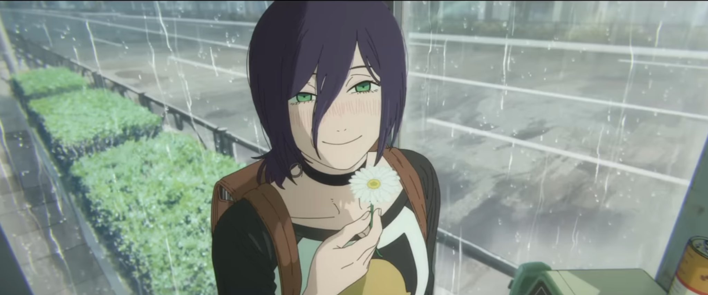
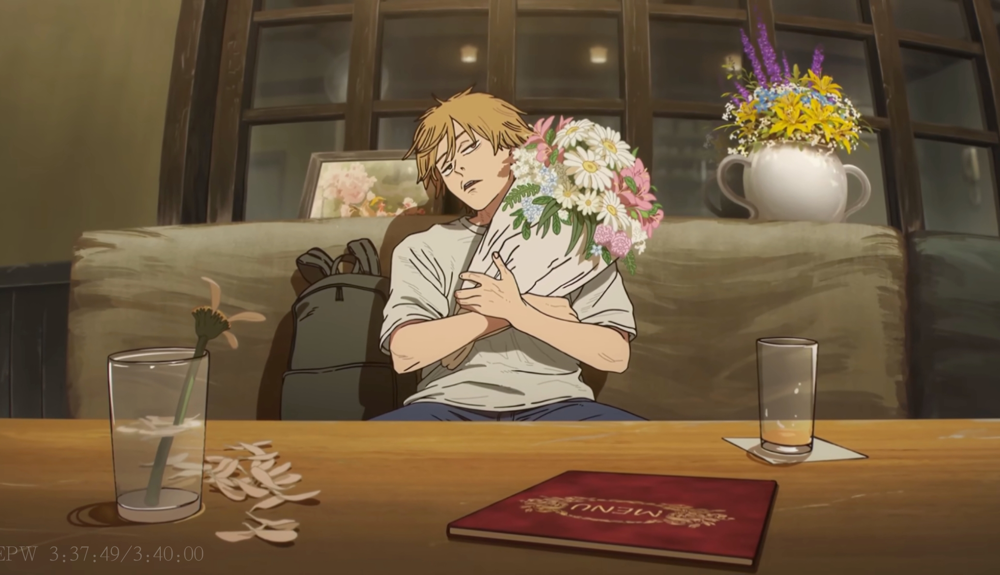
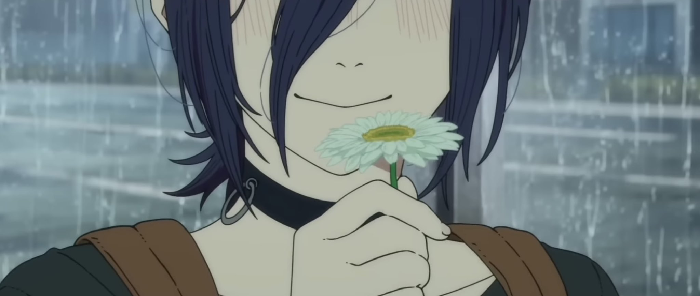
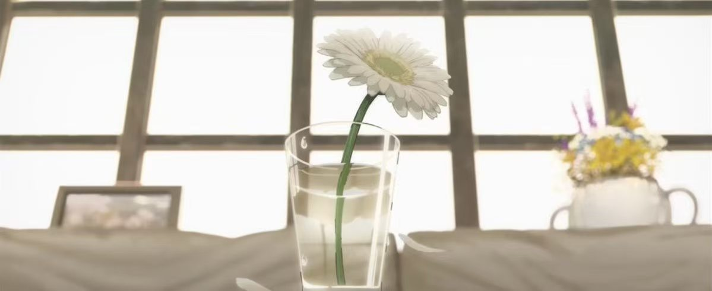
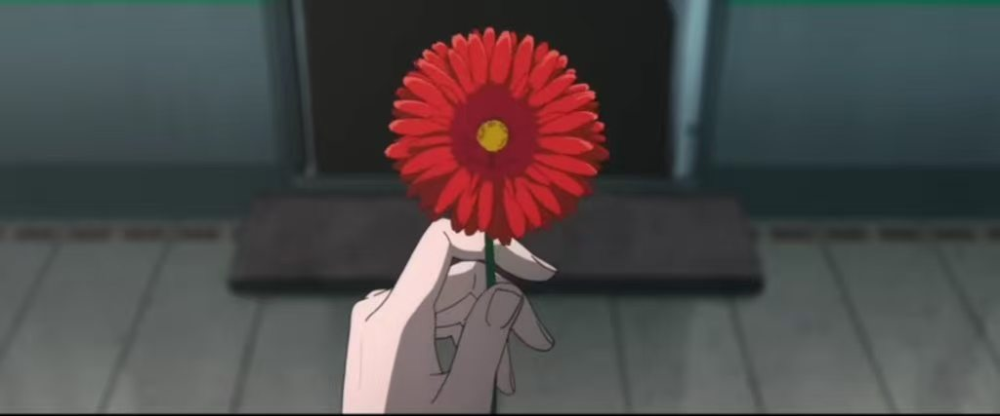
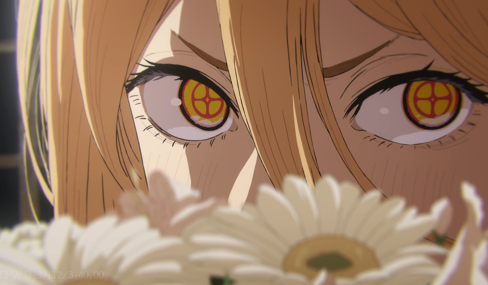

这大概是今年看完，唯一能够直率的说出，真是一部好电影啊，的动画电影了，现在很多电影只是把tv的节奏搬到了大屏幕上，甚至搞总集篇，或者纯粹作为一个视觉上的卖点，电影这一载体本身的艺术性却感觉没太多被表达

蕾塞篇，在做到有精彩的视觉效果的前提下，还把电影的艺术性展现出来，更重要的是，他完整的讲完了一个有趣的，动人的故事

---

如果让我用一句话来描述这个故事的话，那我会说这是个两个陌生人从相识到相恋，再到再也不能相见的故事

当然这句话似乎省略掉了电锯人这部作品本身所有的要素，但难道不是吗，我们是其实是被非日常中的日常所打动的，被情窦初开，内心面对朦胧情愫的不知所措所打动，被那个从犹豫烦恼到最终抛弃生活奔向爱意的决策所打动，被最终双向奔赴而不得遗憾的结局而流泪

他们两人都是舍弃了自己拥有的一切去双向奔赴的，结局却是蕾塞失去了生命，电次永远不知道蕾塞选择了他，而只留下着一段被无情欺骗的失恋回忆

---

电影本身充满了浪漫的元素，咖啡店，花束，学校，充满缺陷的人，一同向前的愿望，抛弃一切私奔的决心，白日的咖啡馆与爱情故事真是太配了，电次在第一次见到蕾塞的时候送了她一枝花，在结尾等她的时候饱了一束花，花瓣一粒一粒落下，也象征着恋情的结束

给我印象最深的是全剧最后的高潮，将激烈的战斗利用有所铺垫的优秀战术收尾，坠入海中，钢琴曲起，学校泳池的回忆涌上心头，两个人一起下坠

下一幕，电次平和的说出自己的心声，在海滩选择放弃自己现有的生活，和蕾塞一起逃走，他给的理由是，自己不愿意把蕾塞交给公安，感觉心里不舒服，而且蕾塞确实教会他游泳了。选择在咖啡店等待蕾塞

蕾塞痴忘着花，回过神来，电车已经离开了，她也意识到自己选择了电次，然后就是遗憾的死去

---

我会在想，我在为什么而感动呢，大致是因为对方舍弃自己的生活而感动吧，纯粹的，冲动的，自然的却是最美好的动机，在现实生活中已经成为了故事，甚至在故事里也没有善终

生活充满了缺陷，但如果能遇到这样的爱情，那真是太好了

