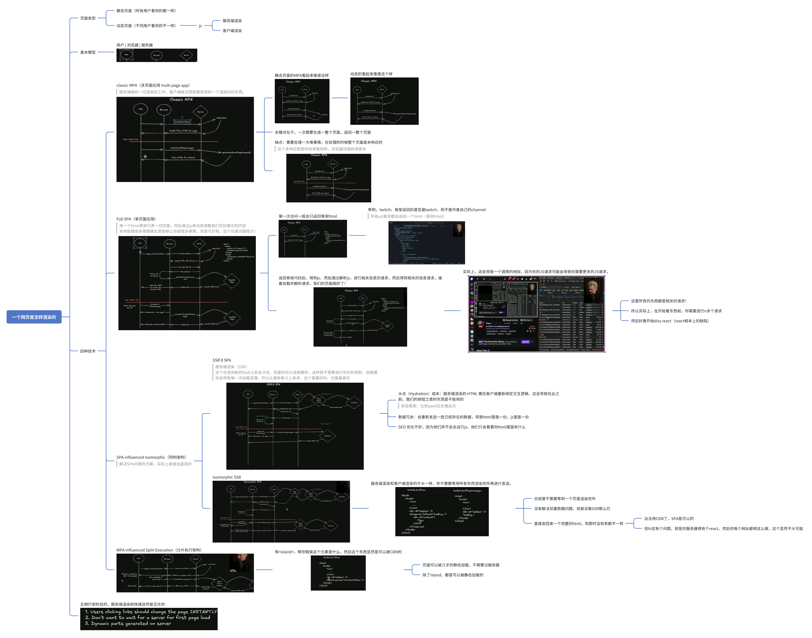
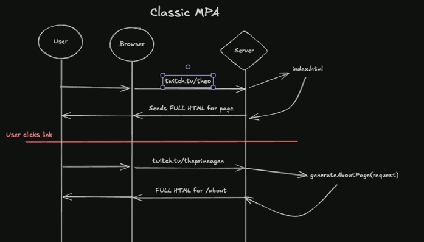
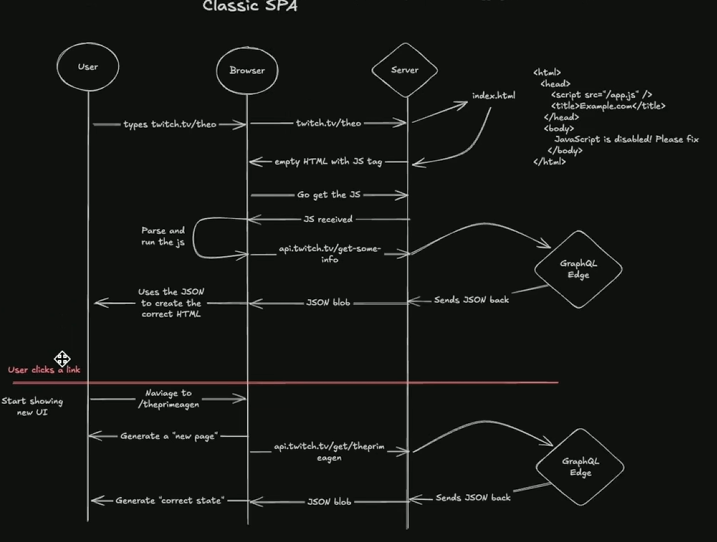
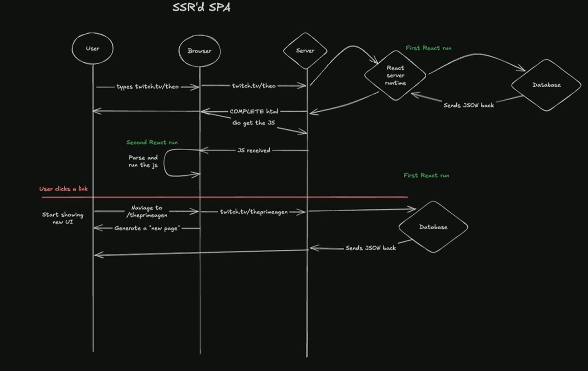
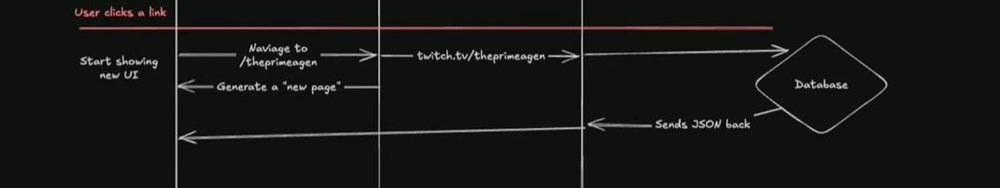
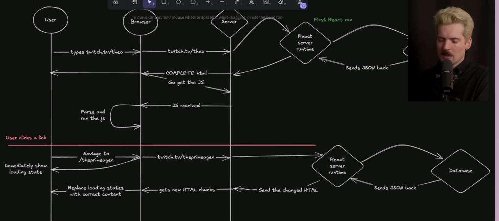
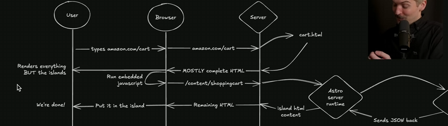

## **现代混合页面**

随着技术发展，静态与动态的界限逐渐模糊：

1. **静态页面的动态化**
	1. 通过 JavaScript（如 React/Vue）实现客户端动态交互。
	2. 结合 API 调用（如 RESTful API、GraphQL）从后端获取数据（如 JAMstack 架构）。

2. **动态页面的静态化**
	1. 使用服务端渲染（SSR）或静态站点生成器预渲染动态内容（如 Next.js、Nuxt.js）。
	2. 通过增量静态生成（ISR）实现内容按需更新（如 Vercel 的 Next.js 方案）。

## theo的视频

https://www.youtube.com/watch?v=Cifkb-ZVps4

# Classic MPA

经典多页应用

* User向Server发送URL请求
* Server找到HTML文件，如果是非静态页面，则会返回一个接受参数，生成HTML文件的函数
* 返回full HTML文件

要点是，HTML文件被创建的时机：

* 要么是在请求服务器之前
* 要么在请求的时候

服务器要么有整个page，要么要生成整个page
用户不操作，就不会有任何流量，没有任何通信

# Classic SPA

经典单页应用

通过URL只会返回一个HTML骨架文件，不会像MPA那样返回完整的HTML文件

* 返回带着js标签的HTML骨架文件
* 浏览器再向Server请求js文件
* 浏览器得到js文件，解析并运行js文件，向API发出请求
* Server返回json数据
* 浏览器使用json创建出完整的HTML

在上述的流程完成后，用户点击了链接，
不会像MPA那样只在浏览器顶部有一个缓慢的进度条，作为点击链接等待的反馈
而是浏览器立刻切换HTML进行页面切换

如果使用了React Router或者一些路由系统，它会将UI组件与URL绑定
进行页面切换，渲染新的组件，内部可能存在新的请求，重复下面的步骤

* 浏览器得到js文件，解析并运行js文件，向API发出请求
* Server返回json数据
* 浏览器使用json创建出完整的HTML

不同的是，此时的Loading可以是一个Loading spinner，并且部分内容立刻就能渲染，而不是MPA那样只能等待浏览器的加载条

## 缺陷

用户点击的下半部分确实对MPA的体验进行很多优化
而问题在于上半部分，除非做完上半部分的工作，用户是不能看到正确的HTML内容的

**经典SPA的优点和缺点**：

* **首次加载慢**：由于需要经过多次请求（HTML -> JS -> API数据 -> 客户端渲染）才能显示页面，SPA的首次加载速度通常较慢。在某些情况下，可能需要发送几十个请求才能显示内容。

* **导航更快**：一旦JavaScript加载完毕，用户在SPA内部点击链接时，浏览器可以直接生成新的UI，而无需等待服务器发送完整的HTML页面，这使得内部导航感觉更即时、流畅

# SSR's SPA

Server side rendering的想法是
为了避免 **经典SPA** 首屏加载问题，

1. **服务器渲染**：与发送空HTML不同，SSR SPA在服务器上运行渲染代码（例如React），生成**完整的HTML**页面。这意味着服务器会根据请求，生成包含所有内容和数据的HTML，并将其立即发送给用户。
2. 此时browser也能知道HTML中的js tag，会并行的获取js解析js运行js，但不用再获取数据了
3. 但是服务器在渲染HTML时，通常会将页面所需的数据嵌入到HTML中，这样客户端就不需要再次发出API请求来获取数据。例如，Next.js会将数据嵌入到`next-data`属性中。
4. **Hydration**

React code做的就是生成HTML文件，在这个过程中进行事件绑定和交互逻辑，而如果客户端已经有了完整的HTML，React怎么知道按钮对应哪个onclick呢？

解决此问题的这个过程称为**Hydration（注入水分，水合，注水激活）**
它将在客户端上重新运行一遍相同的React code

React code会跑两次

* 在Server会跑一次用于返回完整的HTML
* 在Client会跑一次用于事件绑定和交互逻辑

（涉及React的底层原理）

当客户端的JavaScript加载并运行后，它会重新运行相同的渲染代码，将事件监听器和交互逻辑绑定到已经存在的HTML元素上。

这个过程被称为“水合”。通过水合，客户端的JavaScript可以接管页面，使其具备交互性。

## 优点

在水合结束后，所有的js内容已经加载了，所以不再需要通过服务器生成整个界面，它只需要获取数据部分

所以直接访问数据库就行了

这意味着，他与classic SPA相比，

* 可以直接得到完整的HTML，优化首屏加载速度
* 保持了SPA立刻可以显示一些不需要数据的html的优点
* 还对获取数据的过程做了简化

* 另外SPA还可以使数据持久话，让相同的内容可以轻易的在不同的page间共享，因为它没有进行浏览器的导航

  * 例子就是，小窗播放的功能，需要SPA对数据的持久化，才能轻易的实现

## 缺陷

* 水合（Hydration）成本：服务端渲染的 HTML 需在客户端重新绑定交互逻辑，这会导致在此之前，我们的按钮之类的东西是不能用的 有些框架，比如qwik在处理这点
* 数据冗余：会重新发送一些已经存在的数据，导致html里面一份，js里面一份
* SEO 优化不好，因为他们并不会去运行js，他们只会看看你html里面有什么

然而，nextjs的工作方式是，它会阻塞整个界面，直到其拿到最后一步的json blob

所以在过去的nextjs，page router模式下，你在点击链接后，只能等待整个过程走完（拿到json blob）之后，才能显示内容

我们期待的体验是，在点击链接后，先在数据无关的部分渲染了，并行的获取数据，拿到数据后再渲染剩余的依赖数据部分

由于这种阻塞的情况，当你把所有数据都使用这样的SPA来解决时，获取数据会变慢，所有事情都在客户端处理，大量的数据又会阻塞navigation

那么我们如何解决这个问题？

# Isomorphic SSR

SPA-influenced Isomorphic 同构SSR

同构体现在，同一份代码在服务器和客户端上以不同方式运行，

这意味着开发者可以编写一份代码，部分只在服务器上运行，部分只在客户端运行，而另一部分可以同时在两端运行，但运行方式不同

* **核心改进与工作原理** :
  * **非阻塞导航与流式HTML块**：这是同构SSR的关键优势。通过使用像React `Suspense` 这样的机制，开发者可以指定页面中某些部分（如数据加载中的内容）不应阻塞页面的初始渲染或导航。
    * 当用户点击链接进行导航时，**客户端可以立即显示一个加载状态（通过`Suspense`** &#x7684;**`fallback`** ），而无需等待服务器完全准备好所有内容 。
    * 与此同时，服务器不会重新生成整个页面，而是**只生成那些发生变化的HTML“块”（chunks）**，并以流（stream）的形式发送到浏览器。
    * 浏览器接收到这些HTML块后，会用它们替换掉之前显示的加载状态，从而逐步填充页面内容 \[2]。
  * **减少数据传输和JavaScript包大小**:

    * 服务器组件（Server Components）等技术允许大部分渲染逻辑和数据获取在服务器端完成，并直接发送HTML，而不是发送包含所有可能UI状态的巨大JavaScript文件和JSON数据。
    * 这意味着**很多只需要在服务器上运行的JavaScript代码不再需要传输到客户端**，从而减少了客户端JS包的大小和数据重复问题 \[2]。

* **优点** :

  * **即时导航体验**：用户点击链接后几乎立即看到响应（可能是加载状态），大大提升了感知性能 。
  * **HTML优先的开发**：结合了MPA的HTML优先渲染优势，提供完整的HTML内容，对SEO友好，同时享受SPA的动态交互。
  * **优化的开发者体验**：开发者可以在服务器和客户端之间灵活地划分组件，无需在两种模式之间进行权衡。
  * **降低客户端JS负担**：将复杂的渲染逻辑和大量数据移至服务器处理，减轻了客户端浏览器的负担，特别是对于包含大量动态内容的页面 。

* **缺点** :
  * **无法使用静态CDN托管完整HTML**：由于页面内容（尤其是动态部分）是在服务器端实时生成的，因此不能像经典SPA或静态MPA那样简单地将完整的HTML文件缓存到CDN上 。**每个请求都需要服务器端JavaScript来生成页面** 。

  * **复杂的后端需求**：这种模式要求在服务器端运行React（或类似框架）代码来解析和生成整个网站的HTML。对于一些前端团队来说，这可能意味着需要涉足后端基础设施，或者现有后端架构（例如使用Go语言的API）需要进行调整。

  * **基础设施复杂性**：为了实现快速的静态部分响应和动态部分的流式传输，可能需要复杂的边缘工作者（Edge Worker）基础设施来实现部分预渲染（Partial Pre-rendering）。这可能需要专门的平台（如Vercel）支持，或者需要前端开发人员具备深厚的DevOps/基础设施知识。

# MPA-influenced split-excution(Islands/Server Components)

MPA-influenced split-execution（多页应用影响下的分割执行）模型是当今网络应用渲染策略的一种演进，它与同构 SSR（服务器端渲染）模型类似，但解决了一些不同的问题。

以下是该模型的详细介绍：

**核心概念与原理** MPA-influenced split-execution 的核心思想&#x662F;**“岛屿（Islands）”架构**。在这种模式下，页面的大部分内容是静态的，可以像传统多页应用一样被静态托管，而只有少数动态、交互式的部分被视为“岛屿”。

* **静态内容优先**：页面的主要骨架和非动态内容会生成为静态 HTML 文件。这意味着你可以将这些文件部署在静态 CDN（内容分发网络）上，如 S3，从而实现页面**几乎即时**的加载速度。用户在导航到页面时，会立即看到页面的大部分静态内容。

* **动态“岛屿”**：页面中的动态部分（例如用户的购物车内容）会被标记为“岛屿”。这些岛屿在初始加载的静态 HTML 中通常是空的或带有占位符。

* **嵌入式 JavaScript**：一旦静态 HTML 加载完成，一小段**嵌入式 JavaScript** 就会在客户端运行。这段 JavaScript 的作用是扫描页面，识别出所有的动态岛屿。

* **按需获取动态内容**：对于每个识别出的岛屿，该嵌入式 JavaScript 会向服务器（例如 `api.example.com` 或 Astro 服务器运行时）发起一个网络请求，以获取该岛屿所需的**动态 HTML 内容**。服务器会根据请求（可能包含用户的 cookie 等信息）生成相应的 HTML 片段，并直接将其发送回浏览器。

* **客户端注入**：浏览器接收到这些 HTML 片段后，嵌入式 JavaScript 会将其插入到页面中对应的岛屿位置，从而完成页面的渲染。

* **加载流程示例** 以访问 `amazon.com/cart` 为例，其加载流程如下：

1. 用户访问 `amazon.com/cart`。
2. 服务器立即发送一个**预生成的（几乎完整）HTML 文件**给用户，该文件包含页面所有静态部分。用户几乎可以立即看到页面内容，但动态岛屿部分（如购物车）是空的或带有占位符。
3. 一小段**嵌入式 JavaScript** 在浏览器中运行。
4. 该 JavaScript 识别出购物车岛屿，并向服务器（例如 Astro 服务器运行时）发送请求，以获取购物车的动态内容。
5. Astro 服务器运行时可能会查询数据库以获取用户的购物车数据（JSON 格式）。
6. 服务器根据数据生成**购物车的 HTML 内容**，并将其直接发送回浏览器。
7. 浏览器中的 JavaScript 将接收到的 HTML 片段注入到购物车的岛屿位置，用户最终看到完整的页面。

**优势** 这个模型旨在融合传统多页应用和单页应用的优点：

* **第一页加载速度快**：由于大部分内容可以从静态 CDN 加载，用户在首次打开页面时无需等待服务器生成完整页面，显著提升了加载速度，避免了服务器冷启动等问题。

* **更好的用户体验**：用户点击链接时，页面的静态部分会**即时响应**，提供即时反馈，就像代码在本地运行一样。

* **动态内容在服务器生成**：关键的动态部分在服务器上生成，避免了单页应用中大量 JavaScript 在客户端解析、运行、多次 API 调用、渲染组件的复杂且耗时的过程。这减少了发送到客户端的 JavaScript 文件大小，因为无需包含所有可能的 UI 状态和渲染逻辑。

* **降低基础设施复杂性**：与需要智能边缘工作器（Edge Worker）的预渲染模型（如 Vercel/Next.js）相比，MPA-influenced split-execution 模型的基础设施**显著简化**。静态部分可以托管在 S3 等简单存储服务上，而动态部分可以由简单的 Node 服务器或 Lambda 函数处理。

* &#x20;**SEO 友好**：由于初始 HTML 包含大量实际内容，这对于搜索引擎爬虫非常有利，因为它们主要查看 HTML 内容而不是执行 JavaScript。

**潜在缺点和权衡**

* **动态内容加载非同时**：与一些高级的边缘工作器模型不同，该模型**无法同时**启动静态 HTML 的传输和动态内容的生成。客户端必须先接收到静态 HTML，然后嵌入式 JavaScript 才能发起对动态岛屿内容的请求。这意味着动态内容的显示会有轻微的延迟。

* **前端团队需具备后端知识**：为了实现服务器端动态内容的生成，前端开发人员可能需要更深入地了解后端代码和服务器运行环境。

* **无法缓存整个页面**：动态岛屿的存在意味着整个 HTML 文件不能完全静态化并缓存在 CDN 上，因为它会根据用户请求动态生成部分内容。

总之，MPA-influenced split-execution 模型提供了一种**折衷方案**，它在保持即时首屏加载速度的同时，允许服务器按需渲染动态内容，从而优化了用户体验和开发效率。

# 期待的效果

## **三个主要目标**

1. **即时页面切换体验**

   * 用户点击链接后，页面应该**瞬间更新**，不能出现“点击了但不知道有没有反应”的情况。
   * 希望像单页应用（SPA）一样，导航过程流畅。

2. **客户端交互灵活**

   * 能在客户端实现复杂交互，例如**弹出视频播放器在页面切换时不消失**。
   * 避免因为刷新整个页面而丢失组件状态。

3. **首屏加载不依赖服务器渲染**

   * 不想等待服务器生成页面（SSR）后再展示，尤其是在**无服务器（Serverless）+冷启动**的场景下，可能要几秒才能开始响应。
   * 希望用户能**立即看到内容**，而不是先等待 HTML + 数据生成。

***

## **额外的需求**

* 某些**动态部分仍需要服务器生成**（比如个性化数据）。
* 但又**不想走传统 SPA 那种模式**：HTML加载→解析JS→JS请求数据→渲染→发现还要请求更多数据→继续等待。（动态内容在Server side）

***

## **核心矛盾**

* 如果页面是**纯静态**（CDN缓存），切换快，但动态部分就没法 SSR。
* 如果动态部分放在服务器端渲染，就必须等服务器生成完整 HTML，这会阻塞页面显示。
* 目标是既要**SSR动态部分**，又要**不影响首屏加载速度和流畅导航**，但这两者“天然对立”。