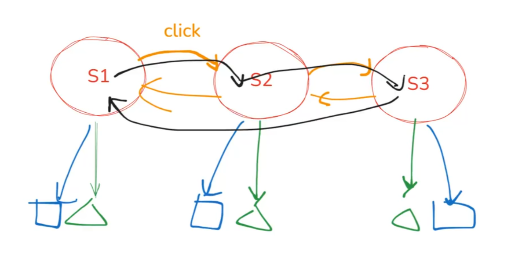

## React是什么？

是一个UI 库：你描述 UI，库自动帮你操作 DOM。
带来编程思维的转变，使得前端开发不用再关注DOM的维护

即将命令式编程，转换为声明式编程

* **命令式编程** 关注 **“怎么做” (How)** —— 你需要一步步告诉计算机如何执行任务。
* **声明式编程** 关注 **“做什么” (What)** —— 你只描述你想要的结果，而不关心具体的执行步骤。

React提出的模型：声明式编程
你的 UI 不应该是手动拼出来的，而是由数据自动生成的。
这成了现代的UI library几乎共同遵守的范式

react的核心哲学：**UI 是状态的纯函数**
这是一种react专属的声明式模型

声明式编程的效果+函数式编程实现：就是UI = f(state)
* React 选择了一条“函数式 + 不可变数据”的路来实现声明式。
* Vue 选择了一条“响应式 + 可变数据”的路来实现声明式。

## Why  declaration？

人脑不擅长处理动态的过程，所以在程序设计中，我们应该尽可能让静态的部分，即程序纸面上的样子，更能直接表达其意思，并简化动态过程带来的信息，即模拟程序运行后的过程才能理解的内容

典型的例子就是JavaScript中的this，它的动态绑定

一个复杂的app中，一个按钮的事件，追踪事件，查找DOM，改变UI等等是一个非常困难的过程
因为命令式编程的这种行为，出了bug，需要去考虑上述繁重的动态过程，渲染的过程是不确定的

React，直接控制了渲染的过程，直接让状态决定渲染的结果
这样声明式的效果，避免了极大的复杂度和开发体验

## UI = f(state)的实现蓝图：

函数式编程 (Functional Programming, FP)

* **关注点：** **代码的组织方式**（How to write code）。
* **核心思想：** 将计算视为数学函数的求值，并强调使用 **纯函数** (Pure Functions) 和 **不可变性** (Immutability)。

  * 纯函数定义：
    1. **相同输入 → 必须产生相同输出**
    2. **不能改外部变量（无副作用）**

  * render函数必须是纯函数
  * state 必须被视为不可变的值（immutable）
    * 更新 = 创建新对象，而不是修改旧对象。
    * 这里和react render函数的具体实现相关

react中声明式（declarative）实现——函数式编程：
* UI = 输出
* state = 输入
* render = 映射关系

① UI = f(state)（函数式 UI 思想）
→ ② rerender, don't mutate（每次重新渲染）
→ ③ 需要一种轻量对象来描述 UI → React Element
→ ④ 为了高效更新 → diff → Virtual DOM/Reconciler
→ ⑤ 写 element 太累 → JSX（语法糖）

### Why rerender?

写界面, 永远有一种复杂度, 数据变了, 界面要变!
而react的函数式哲学下，发生的事情不再是某个DOM节点的更新的动态过程，

而是进入一个新的输入，经过render函数，产生新的输出，覆盖掉原本的输出，也就是再次调用render函数

也就是rerender
再走一次render函数意味着什么？意味着整个DOM树的重新生成，这显然是不可行的，有巨大的性能问题

### Why React Element Tree （v-dom）?

#### 1. Better performance

每次都重新渲染，显然造成性能问题
为了解决这个问题，React做了优化，引入了Virtual Dom，即一个代表DOM节点的对象，即react Element
> 但这依旧允许你逻辑上认为React是做了替换或者重新渲染了，因为V-dom是一个保证React哲学前提的性能优化

1. 他将浏览器端端dom操作转换为内存中的对象操作
2. 这个中间的对象，允许在中间层做一系列性能优化措施，diff，reconcile，虚拟事件，批处理防抖
* 组件被初次渲染时会自动创建v-dom
* 数据更新
* 创建新的v-dom
* 内存中进行，因此速度非常快。
* 计算最小更改
* 匹配并修改真实dom

这个过程是很快的，因为vdom本质是一个对象，在内存中对对象进行操作是很快的
而对真实的dom修改是很慢的，因为它会影响页面渲染的时间，浏览器会带来很多副作用，会干涉影响拖慢计算结果

另外它会有类似防抖的处理，会收集短时间的事件结果，再一次性创建vdom应用
这背后也包含了一个类似虚拟的事件系统，真实的事件会被转换为虚拟的事件，反应到vdom上，脱离浏览器使得性能更快
脱离浏览器意味着它能在更多的地方运行了，比如nodejs，然后可以脱离浏览器进行测试，svg，canvas等等的支持，在web worker中进行处理，等等有趣的特性
#### 2. Just JS

**为了rerender的性能优化空间，发明了react Element的这一对象**
**React Element是为了优化dom操作性能的，一种对 DOM 描述的js对象**

HTML本身只能渲染静态内容，为了将templates中注入后端数据变化，必须自定义一套特殊的语法，比如 `{{}}`，vue中的v-if，v-on等等特殊的markup，否则无法将数据注入HTML中，所以vue虽然JavaScript好写，而它的template是比较难写的
模版的想法为了实现各种功能，不得扩展HTML，而这就像是创造了一个新语言
但这些特性本身JS就有了，为什么我们还要再这么做呢
有了react element的情况下，恰好就避免了模板语法的复杂度，将逻辑复杂度回归至js中，因为react element本身就是一个js对象，不需要直接对dom或者html进行修改
有了react element的情况下UI = f(state)的f：
**`state => react element(v-dom) => dom`**
将dom的操作转换为对v-dom的操作，而对v-dom的操作就只是对javascript对象的操作
对javascript对象的操作，显然可以通过函数来封装复用，与react函数式的思想不谋而合
最终导向了
Component is a function，就是一`React.createElement`;函数的设计
组件的嵌套，就是函数的嵌套，
函数的调用，React中的意义就是执行渲染（render）
函数的嵌套不代表调用父函数，就会调用子函数

函`React.createElement`旧是会立刻执行的，
但是他本身接受的是函数对象，返回的也是对象，全程不涉及函数调用
* **它的输入**：一个组件函数（或字符串）、props。
* **它的输出**：一个包含了这些输入的、结构化的JavaScript对象（React元素）。

这个对象是一个**中间产物**，一个**数据结构**。它把执行的权力**延迟**并**移交**给了React的渲染器。

这种延迟加载技术就是better performance的来源之一
Component is a function，React is Just JS

### Why  jsx?

1. Logical concern

> 真正的关注点分离应该是减少耦合，增加内聚

而是将应该在一起的东西在集合在一起，逻辑上集中，才是真正易于维护的，
而不应该将真正就是紧密结合的部分进行分离

传统工程师认为：

> “这样把 HTML 混进 JS，是倒退。”

React 团队认为：

> “模板和逻辑放一起才是一个组件真正的关注点边界。”

按照UI单元区分，把UI单元之间解耦，而不是把逻辑和模板解耦，因为我们思考问题的时候，
往往是对一个子UI单元的逻辑和结构同时的思考

* jsx是createReactElement的语法糖，简化了代码编写

### react的蓝图

为了实现react的函数式特性，我们做了以下三个决策
1. Components，not templates
2. Rerender, don't mutate
3. Virtual dom is simple and fast

让react的实现有了明确的方向和思路，
用jsx和函数式组件组织语法，通过react element做性能优化
这使得函数式模型的带来的一些直接问题有解

## state ——渲染的数据源

React 与 Vue 在状态管理上选择了截然不同的道路，这决定了 State 的根本属性：
* **Vue**：走“响应式 + 可变数据”之路，依赖细粒度的依赖收集，允许直接修改数据。
* **React**：走“函数式 + 不可变数据”之路，追求声明式与纯粹性。
**结论**：在 React 中，State 必须被视为\*\*不可变值 (Immutable Values)\*\*。

* **什么是 State**：驱动 UI 变化的最小变量集合。
* **State 与 派生数据**：State 是原本的数据源（Source of Truth），派生数据（Derived State）是基于 State 计算得出的投影。
  * *原则*：能通过计算得出的都不应成为 State，以避免数据冗余和同步问题
  * 不过这两者都属于UI = f(state)的state即渲染的数据源，这里有微妙的语义上的差异

心智模型：不可变快照 (Immutable Snapshots)

React 将 UI 渲染视为随时间流动的“帧”。

* **快照性质**：State 不是一个随时间改变的变量容器，而是特定渲染帧中固定的、只读的“常量”。
* **渲染即投影**：每次渲染都是基于当前 State 快照生成的全新 UI 描述。
* **更新即替换**：`setState` 从未修改旧快照，而是请求 React 生成一张包含新数据的新快照，并触发整个组件函数的重新执行。

从编程语言设计的角度审视 React State：
* **数据所有权转移**：`setState` 本质上不是赋值，而是**Move 语义**（类似 Rust）。旧状态的所有权被废弃，控制权移交给新创建的状态。
* **函数式语义**：State 的更新遵循 $UI = f(State)$，因为 $f$（组件）应当是纯函数，所以入参 State 必须不可变，以保证相同的输入永远产生相同的输出（UI）。
### Why Immutability？

* **浅比较策略 (Shallow Compare)**：
为了高性能地判断“是否需要更新”，React 仅对比对象的内存引用（`prev !== next`）。
* **推论**：为了通过低成本的“引用比较”来驱动更新，必须在数据变化时创建全新的对象引用。
  * *注*：虽然创建新对象繁琐（可用 Immer 库缓解），但换来了逻辑的可预测性和时间可回溯能力。



可以把React的渲染，简化抽象成一个状态机，不同的页面是不同状态的组合，帧其实是指向状态的指针

这个模型去掉了生命周期，所以没有时间的概念，都是常量，没有运动，有运动才有生命周期
逻辑简化了视角，人好推理
执行时，真实则不完全是按照这个模型做了大量的跳过计算，优化

* 蓝色是挂载的副作用，绿色是对应的DOM节点
* 但是实质上中间充满了细节，人脑很难处理这些细而复杂的过程

## f —— 渲染模型

代码层级的详细流程：[ React Rendering Summary](https://ai.feishu.cn/wiki/L6zNw43RNiJci1kTuSwcNK7Qn4g)

### Render Phase


前文提到react element可以使DOM操作脱离浏览器环境，从而进行一系列性能优化的措施

那么这些措施，即渲染的模型，背后的逻辑具体是怎么样的


一次最小化更新的渲染流程：

1. 创建新的reactElement Tree

2. 和上一帧的旧 Virtual DOM做比较

3. diff 两棵树

4. commit DOM


但是如果按照这种模型

**`state => react element(v-dom) Tree =>dom tree`**

React 在 render 阶段会从根组件开始递归调用所有子组件的 render，并立即进行 diff。

ReactElement 的嵌套 structure（深度嵌套的 JSON 树）直接导致了它必须通过同步递归遍历。

这个过程完全不可中断，如果一棵树需要几十甚至几百毫秒才能 diff 完成，那么在这段时间里浏览器主线程会始终被 JavaScript 占用，依然会造成严重的性能问题


允许中断意味着你要能：

* 停下来

* 保存当前执行上下文

* 稍后恢复

* 从中间某个节点继续执行


Element架构不可中断，原因如下

① 递归结构不可中断

② Element 不可变导致无法存储运行时信息

③ 副作用穿插在渲染中导致渲染无法重来，因为不可变本身也不可靠了，因为它们不具备“可重放与可回滚”的属性


所以我们需要一个结构，

1. 他能够代表DOM的树状结构，但同时他的递归遍历可以中断

2. 这个结构对象应该记录执行状态的信息，因为只有他被记录在对象中，而不是只在执行上下文，因为执行上下文的数据会随时丢失，我们如果中断，数据就可能丢失，就无法调度

3. 它本身应该单独开一层，接收可变操作，而使得Element层彻底纯粹可靠


结论就是——fiber

每一个 Element 对应一个 Fiber，

1. 不直接通过对象嵌套，而是通过一个Child属性，通过指针来指向子Fiber的链表树结构

2. 存储着执行状态的信息，会显式的记录状态信息

3. 可以执行可变操作，保证render Phase彻底纯粹


能不能用Fiber替代Element？

不行，因为中断调度是Fiber带来的能力，而最小化更新是Element带来的能力

最小化更新的前提是和确定的，可靠的，immutable的UI结构做对比才能决策出的结果

可中断调度的Fiber是完全不可靠的，靠对比Fiber完全无法确定推理出正确的最小化更新目标，因为你不知道你对比的瞬间他有没有因为什么原因Mutate


结论是以下的模型

**`state => react element(v-dom) Tree => react fiber tree =>dom tree`**


```plaintext
没有fiber层时：
1. render() → 生成完整的 Element Tree
2. 对比新旧 Element Tree（同步递归 diff）
3. 生成 DOM 操作列表
4. 一次性应用所有 DOM 更新

---
有fiber层后：

1) Render Phase（生成 workInProgress Fiber Tree，可打断）

2. 每个组件 render() → 新 Element Tree
3. Reconciler: 用新 Element Tree 对比旧 Fiber Tree
4. 产生新的 Fiber 节点或复用旧 Fiber
5. 标记每个 Fiber 的变更（Placement / Update / Deletion）

6) Commit Phase（不可中断，应用变更）

7. 根据 Fiber 上的 effect 标记，执行 DOM 操作
```


### Commit Phase——mutate


React 组件函数原本是**纯函数**：

但是 UI 不是完全静态的——它需要：

* 状态（state）
* 生命周期（mount/unmount）
* 副作用（数据请求）
* 引用（DOM 引用）
* 缓存（memo）

如果你把这些功能硬塞进函数里，函数就变成不纯了。

> 组件函数依然只像一个纯函数，不要 class，那状态和副作用放哪？

React rerender的最小化更新，依赖纯函数的不可变特性，这些都是为了react的性能优化而不可或缺的内容

那这些副作用和操作怎么办，不能修改Element的结构


在没有 Fiber 层的时候，React 只能依赖类组件，把副作用、状态、生命周期等复杂度都塞进组件实例里，导致 render 并不纯；生命周期方法在渲染过程中交织执行，也使得 React 无法严格贯彻“构建 UI 的过程与执行副作用的过程分离”的原则，更无法中断渲染、重新开始或做时间切片。

> 也就是说没有fiber时，连最小化更新都是不可靠的，可能会被mutate干扰


**class 的本质：**

* 一个对象，用来存状态（this.state）

* 一些方法，用来执行副作用（componentDidMount、componentDidUpdate、componentWillUnmount）

* 一个 render 方法，用来计算 UI

这三类能力必须拆开，否则 render 永远不纯。


hooks就是封装这些可变操作的函数，原本没有fiber状态，必须同步执行，就必须立刻调用，这导致了可变性

| class 功能                  | 对应的 Hooks / Fiber 能力               | 关键差异                                |
| ------------------------- | ---------------------------------- | ----------------------------------- |
| 存状态                       | `useState`（存入 fiber.memoizedState） | 不需要实例，状态存 Fiber，上一次渲染的快照被保留，可中断     |
| 派生状态                      | `useMemo` / `useCallback`          | 纯计算缓存，跟副作用完全独立                      |
| 副作用（Mount、Update、Unmount） | `useEffect` / `useLayoutEffect`    | 副作用移动到 commit phase，全局可控，不污染 render |
| 生命周期                      | 由 Fiber commit flags 决定            | 不在 render 中执行，更严格                   |
| 实例字段                      | `useRef`                           | 不需要 class，也不影响纯度                    |
| 订阅、外部资源                   | `useEffect`                        | 确保按调度执行，可取消                         |
| DOM 操作                    | `useLayoutEffect` / ref            | 仍仅在 commit 时执行                      |

Hooks 是 class 功能的 **按职责拆分**，而不是 class 的语法糖。


Fiber 的出现恰好解决了这个无法摈弃的复杂度：Fiber 本身是可变的、可复用的、带有状态的，并负责在 render phase 中记录所有 hooks、effect、更新标记等运行时信息；而 Element 得以保持不可变、作为纯粹的 UI 意图描述。


现在可以将这些函数存在fiber中，延迟执行，这样就保证了render Phase的纯粹性


这样 React 可以在 render phase 中只做纯计算、不触发副作用，也不产生 DOM 变动，让整个阶段可中断、可恢复；再在 commit phase 中一次性执行所有 Mutation（DOM 更新、effect、生命周期回调），把杂质集中处理。


这样 React 内部就能做到：

* **Element：纯描述（不能存状态）**

* **Fiber：可变、可打断的运行时容器（存状态 + 副作用 + 调度信息）**