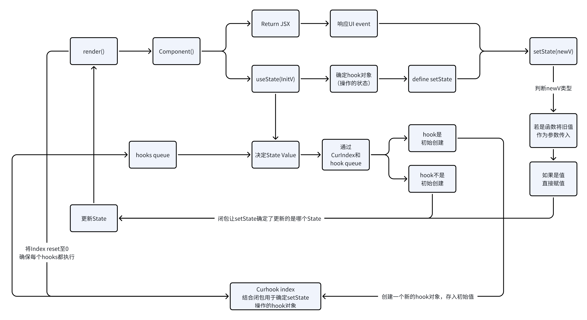

* 要素
  * React Runtime
    * hooks queue
    * Render函数
    * State hooks
  * Component
* Hooks queue
  * 一个队列，维护一个组件内所有要执行的hooks
  * 存在一个Index记录当前执行的hook
* setState做的事情：
  * 更新状态
  * 触发rerender
* 为什么使用闭包创建setState
  * 因为执行过程中，外部index一直在变，闭包可以存储住hookIndex，让setState能确定正确的hooks
* 为什么使用setState，二次Render时不会使用初始值覆盖
  * useState中的赋值不会被setState导致的Render触发
  * 因为，只有在index和当前hooks.length相等时（领先于最大索引）意味着就是第一次useState
  * 如果不符合上述条件（每次Render，index会重置为0），意味着不是第一次
  * 如果不是第一次，useState的initialState就不会被使用，而setState传入的action依旧会被使用
* 代码中hook对象内部的queue的作用是什么
  * 收集事件带来的结果，避免重复多次的Render，而是收集结果最终就渲染一次

```javascript
// --- 模拟 React 内部的“全局”状态存储 ---
// 存储当前组件的 Hooks 链表
let hooks = [];
// 指向当前正在处理的 Hook 的索引
let hookIndex = 0;

// 模拟一个“渲染”函数，它会执行组件函数
function render(Component) {
    // 每次渲染前重置 hookIndex，确保从头开始处理 Hooks
    hookIndex = 0;
    console.log("--- Component Rendering ---");
    // 执行组件函数，Hooks 会在其中被调用
    const output = Component();
    console.log("Render Output:", output);
    console.log("--- Render Complete ---");
    return output;
}

// --- 模拟 useState 实现 ---
function useState(initialState) {
    // 第一次渲染时，创建并存储 Hook
    if (hooks.length === hookIndex) {
        // 创建一个包含状态和更新队列的 Hook 对象
        const hook = {
            value: initialState,
            queue: [] // 存储 setState 的更新
        };
        hooks.push(hook);
    }

    // 获取当前 Hook
    const currentHook = hooks[hookIndex];

    // 处理更新队列
    if (currentHook.queue.length > 0) {
        let baseValue = currentHook.value;
        currentHook.queue.forEach(action => {
            baseValue = typeof action === 'function' ? action(baseValue) : action;
        });
        currentHook.value = baseValue;
        currentHook.queue = []; // 清空队列
    }

    // 绑定当前的 hookIndex，形成闭包，确保 setState 更新正确的 Hook
    const thisHookIndex = hookIndex;
    const setState = (action) => {
        // 将更新添加到对应 Hook 的队列中
        hooks[thisHookIndex].queue.push(action);
        // 模拟触发重新渲染 (这里我们直接调用 render)
        // 在真实 React 中，这里会是异步调度
        console.log(`State update at hookIndex ${thisHookIndex}, triggering re-render.`);
        render(MyComponent); // 假设 MyComponent 是我们的组件函数
    };

    hookIndex++; // 移动到下一个 Hook 位置

    return [currentHook.value, setState];
}

// --- 示例组件 ---
function MyComponent() {
    console.log("MyComponent function executed.");

    // 第一个 useState
    const [count, setCount] = useState(0);
    // 第二个 useState
    const [text, setText] = useState("Hello");

    console.log(`Current State: Count=${count}, Text='${text}'`);

    // 模拟一些操作，例如事件处理器
    const handleClick = () => {
        setCount(prevCount => prevCount + 1); // 函数式更新
    };

    const handleInput = (newValue) => {
        setText(newValue);
    };

    // 这里我们返回一个简单的表示来模拟 UI
    return {
        count,
        text,
        // 模拟用户交互，实际中会通过事件触发
        triggerClick: handleClick,
        triggerInput: handleInput
    };
}

// --- 运行模拟 ---

console.log("--- Initial Mount ---");
const initialUI = render(MyComponent); // 第一次渲染

console.log("\n--- Simulating User Interactions ---");

// 模拟点击事件
console.log("\nSimulating: Click to increment count");
initialUI.triggerClick(); // 触发 setCount，会立即重新渲染

console.log("\nSimulating: Typing in input field");
initialUI.triggerInput("World!"); // 触发 setText，会立即重新渲染

console.log("\nSimulating: Click again");
initialUI.triggerClick(); // 再次触发 setCount，会立即重新渲染

console.log("\n--- Final Hooks State ---");
console.log(hooks);
```

