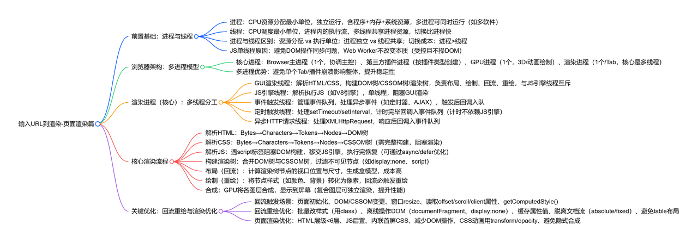
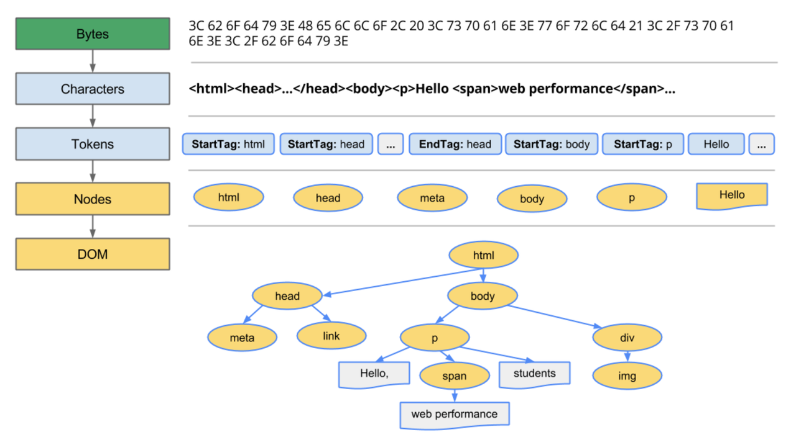
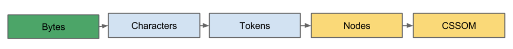
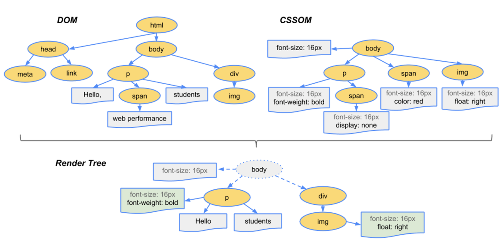
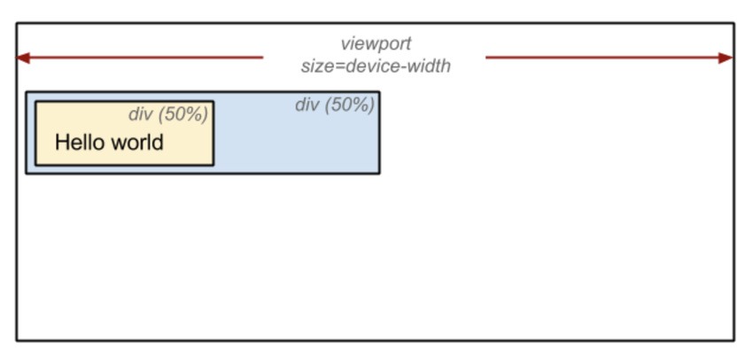

- 输入URL到渲染-页面渲染篇
  - 前置基础：进程与线程
    - 进程：CPU资源分配最小单位，独立运行，含程序+内存+系统资源，多进程可同时运行（如多软件）
    - 线程：CPU调度最小单位，进程内的执行流，多线程共享进程资源，切换比进程快
    - 进程与线程区别：资源分配 vs 执行单位；进程独立 vs 线程共享；切换成本：进程>线程
    - JS单线程原因：避免DOM操作同步问题，Web Worker不改变本质（受控且不操DOM）
  - 浏览器架构：多进程模型
    - 核心进程：Browser主进程（1个，协调主控）、第三方插件进程（按插件类型创建）、GPU进程（1个，3D/动画绘制）、渲染进程（1个/Tab，核心是多线程）
    - 多进程优势：避免单个Tab/插件崩溃影响整体，提升稳定性
  - 渲染进程（核心）：多线程分工
    - GUI渲染线程：解析HTML/CSS，构建DOM树/CSSOM树/渲染树，负责布局、绘制、回流、重绘，与JS引擎线程互斥
    - JS引擎线程：解析执行JS（如V8引擎），单线程，阻塞GUI渲染
    - 事件触发线程：管理事件队列，处理异步事件（如定时器、AJAX），触发后回调入队
    - 定时触发线程：处理setTimeout/setInterval，计时完毕回调入事件队列（计时不依赖JS引擎）
    - 异步HTTP请求线程：处理XMLHttpRequest，响应后回调入事件队列
  - 核心渲染流程
    - 解析HTML：Bytes→Characters→Tokens→Nodes→DOM树
     
    - 解析CSS：Bytes→Characters→Tokens→Nodes→CSSOM树（需完整构建，阻塞渲染）    
    -  解析JS：遇script标签阻塞DOM构建，移交JS引擎，执行完恢复（可通过async/defer优化）
	- 构建渲染树：合并DOM树与CSSOM树，过滤不可见节点（如display:none、script）
		
    - 布局（回流）：计算渲染树节点的视口位置与尺寸，生成盒模型，成本高
		
    - 绘制（重绘）：将节点样式（如颜色、背景）转化为像素，回流必触发重绘
      - 元素发生的改变只是影响了元素的一些外观之类的时候（例如，背景色，边框颜色，文字颜色等），此时只需要应用新样式绘制这个元素就可以了，这叫做 重绘 ( Repaint )
      - 上面我们已经说过了 回流 ，当然也叫 重排 ，要知道，回流 一定伴随着 重绘 ，重绘 却可以单独出现，对比来看，显然回流的成本开销要高于重绘，而且一个节点的回流往往还会导致子节点以及同级节点的回流，所以优化方案中一般都包括，尽量避免 回流
    - 合成：GPU将各图层合成，显示到屏幕（复合图层可独立渲染，提升性能）
  - 关键优化：回流重绘与渲染优化
    - 回流触发场景：页面初始化、DOM/CSSOM变更、窗口resize、读取offset/scroll/client属性、getComputedStyle()
    - 回流重绘优化：批量改样式（用class）、离线操作DOM（documentFragment、display:none）、缓存属性值、脱离文档流（absolute/fixed）、避免table布局
    - 页面渲染优化：HTML层级<6层、JS后置、内联首屏CSS、减少DOM操作、CSS动画用transform/opacity、避免隐式合成

接着构建DOM树和CSSOM树，过程中，如果遇到节点是 JS ，就会调用 JS引擎 对 JS代码进行解释执行，此时由于 JS引擎 和 GUI渲染线程 互斥，GUI渲染线程 会被挂起，渲染过程停止，如果 JS 代码的运行中对DOM树进行了修改，那么DOM构建要从新开始，然后DOM树和CSSOM树构建为渲染树

要知道，生成DOM树时是包括 display:none 的节点的，DOM树和CSSOM树的基础上根据节点的集合属性 margin/padding/width/height等 生成渲染树 ( render ) ，渲染树不包括 display:none 的节点和 head 等节点，但是包括 visibility:hidden 的节点
当渲染树节点因为大小边距等问题发生改变而需要重建的过程，叫做 回流 (Reflow)
元素发生的改变只是影响了元素的一些外观之类的时候 ( 例如，背景色，边框颜色，文字颜色等 )，此时只需要应用新样式绘制这个元素就可以了，称之为 重绘 (Repaint)
回流必将引起重绘，而重绘不一定会引起回流，很明显 回流 代价较大

页面渲染初始化
DOM结构改变，比如删除了某个节点
render树变化，比如减少了 padding ( 内边距 )
窗口 resize 事件触发时
某些 JS 属性，引发回流，很多浏览器会对回流做优化，等到数量足够时做一次批处理回流， 但除了 render树 的直接变化，当获取一些属性时，浏览器为了获得正确的值也会触发回流，这样使得浏览器优化无效
- offset ( Top/Left/Width/Height )
- scroll ( Top/Left/Width/Height )
- client ( Top/Left/Width/Height )
- width, height
- 调用了 getComputedStyle() 或者IE的 currentStyle

## 从URL到浏览器

网络请求过程：

- 首先，客户端浏览器输入URL，由于是域名，应用层DNS开始解析域名，得到目标IP地址
    
    - 首先会查看浏览器DNS缓存
        
    - 没有的话就查询计算机本地DNS缓存
        
    - 还没有就询问递归式DNS服务器（就是网络提供商，一般这个服务器都会有自己的缓存，所以IP查询大多都在这里完成）
        
    - 如果依然没有缓存，那就需要通过 根域名服务器 和 TLD域名服务器 再到对应的 权威DNS服务器 找记录，并缓存到 递归式服务器，然后 递归服务器 再将记录返回给本地
        
    - TCP/IP 五层模型，物理层、数据链路层、网络层、运输层、应用层
        
    
      
    
- 接着，应用层客户端发送一个HTTP请求，把拿到的应用层HTTP请求报文数据分割编号
    
    - `HTTP` 请求分为 `请求报头` 和 `请求主体`
        
    - 在 `传输层` 会把从 `应用层` 接收到的数据 ( 就是那个HTTP请求报文 ) 进行分割，并为每个报文编号后再转发给 `网络层`，编号就是方便服务器接收时能准确地还原报文信息，这里用到了我们常说的 `TCP协议`
        
- 为了方便安全的传输，传输层会通过TCP三次握手建立TCP/IP链接
    
- 建立连接后 `网络层` IP协议会查询服务器 `MAC地址` 也就是物理地址进行数据包的传输
    
- 找到对方的 `MAC地址` 后，将数据发送到 `数据链路层`传输，到此客户端发送请求阶段结束
    
- 接收端的服务器在 `数据链路层` 接收到数据包，再通过相反的方式将数据一层一层的还原回 `应用层`
    
- 服务器接收到客户端发送的HTTP请求后，会查找客户端请求的资源，并返回响应报文
    
- 请求成功后，服务器会返回相应的网页，浏览器接收到响应成功的报文后便开始下载网页，至此，网络通信结束
    

---

浏览器渲染过程：

- 浏览器拿到网页文件后，首先根据顶部定义的DTD类型进行对应解析方式，网页解析会交给内部GUI渲染线程处理
    
- 接着构建DOM树和CSSOM树，过程中，如果遇到节点是 JS ，就会调用 `JS引擎` 对 JS代码进行解释执行，此时由于 `JS引擎` 和 `GUI渲染线程` 互斥，`GUI渲染线程` 会被挂起，渲染过程停止，如果 JS 代码的运行中对DOM树进行了修改，那么DOM构建要从新开始，然后DOM树和CSSOM树构建为渲染树
    
- 然后进入布局阶段，计算渲染树节点在设备视口内的确切位置和大小
    
- 再接着将渲染树中每个节点转换成屏幕上的实际像素，也就是绘制阶段
    
- 最后的合成阶段浏览器会将各层信息发送给GPU，GPU将各层合成，显示在屏幕上