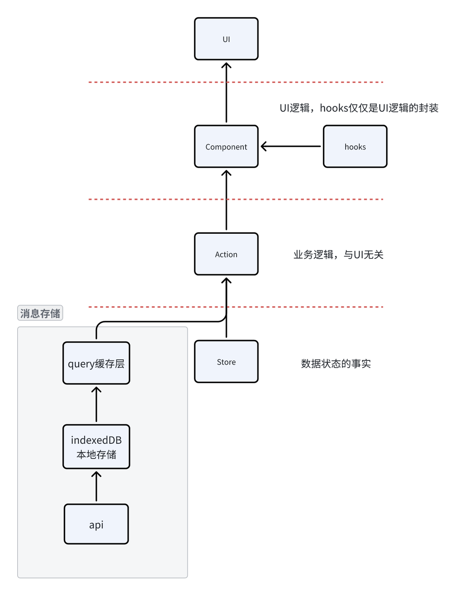

## 分级存储模型


为了避免每次全量获取消息，在indexedDB中对消息做本地存储，这样可以避免每次都全量获取消息，在indexedDB中进行增量获取，减少网络请求频率，并可以结合tanstack query和自定义队列做更新调度

- 局部隔离与性能
- 会话列表和每个 session 分别使用独立队列：避免全局锁竞争、降低单一队列的延时和冲突，同时让不同 session 的写入互不干扰。


- 两类队列的职责分离  
	- sessionListUpdateQueue（全局一份）：只序列化会话列表（ChatSessionsList）的修改（updateSessionList），保证列表修改按顺序、原子地写入 storage。  
	- sessionUpdateQueues[sessionId]（每个 session 一份）：只序列化某个会话（含 messages）的修改（updateSessionWithMessages、insertMessage、updateMessage 等），保证该会话内的所有更新有序、不互相覆盖。

- 为什么能提升性能/并发性

- 局部隔离：不同 session 的写入互不阻塞。两个不同 session 同时写时不会争用同一个队列/持久化操作，降低延时与锁竞争。
- 减少全局阻塞：会话列表的写入与单个 session 的写入分隔开（list 的队列与 session 队列独立），避免写列表时阻塞大量消息写入场景（或反之）。
- 批量合并与限频持久化：UpdateQueue 在微任务周期内合并多次 set，只在 state 发生最终变化时调用 onChange（这里通常是 storage.setItemNow），因此减少磁盘/IndexedDB 写入频率。

- 插入消息（insertMessage）会调用 updateSessionWithMessages，内部会：
    1. 确保为该 sessionId 创建一个 `UpdateQueue（sessionUpdateQueues[sessionId]）`。  
    2. 调用 queue.set(updater)，入队并返回 awaitable 的 Promise。队列在微任务里 flush：串行执行所有入队 updater，合并得到最终 session，然后在 onChange 中调用 storage.setItemNow(StoreStorage.session(sessionId)) 持久化。  
    3. flush 成功后，updateSessionWithMessages 会（若需要）调用 updateSessionList 更新会话 meta（这又走 sessionListUpdateQueue）。最后用 _setSessionCache 更新 queryClient 缓存。  
  - 会话列表修改（createSession/deleteSession/updateSessionList）走 sessionListUpdateQueue，持久化到 StorageKey.ChatSessionsList，然后通过 queryClient.setQueryData 更新缓存。


- 举例对比说明效果  
  - 情况 A（并发写不同 session）：两个请求并发修改 sessionA 和 sessionB，分别走不同的 sessionUpdateQueues，能同时进行各自的持久化，不互相等待。  
  - 情况 B（并发写同一 session）：两个并发修改同一个 session 会被串行化（按入队顺序执行），不会出现最后写入覆盖前一次的竞态。  
  - 情况 C（频繁小更新）：短时间内多次对同一 session 调用 set，会被合并到一次 flush，从而只触发一次 storage.setItemNow，降低 I/O。


## 更新队列

这段代码实现了一个**具有“批处理”、“原子性事务”和“持久化回滚”特性的状态管理队列**。

1. **高频更新的性能问题**：如果一瞬间调用 10 次 set，不需要写 10 次数据库（或触发 10 次副作用），而是合并成 1 次。
    
2. **数据一致性（原子性）**：内存中的状态更新必须和外部存储（onChange）保持一致。如果写入外部存储失败，内存状态必须回滚。

```ts
import type { UpdaterFn } from 'src/shared/types'

// 原子性执行update操作，避免数据竞态
type QueueItem<T extends object> = {
  updater: UpdaterFn<T>
  resolve: (result: T) => void
  reject: (error: unknown) => void
}

export class UpdateQueue<T extends object> {
  private state: T | null = null
  private q: QueueItem<T>[] = []
  private scheduled = false

  constructor(
    private initial: T | (() => Promise<T | null>),
    private onChange?: (s: T | null) => void | Promise<void>
  ) {}

  set(update: UpdaterFn<T>): Promise<T> {
    return new Promise<T>((resolve, reject) => {
      this.q.push({ updater: update, resolve, reject })
      if (!this.scheduled) {
        this.scheduled = true
        queueMicrotask(() => {
          void this.flush()
        })
      }
    })
  }

  /** 可供测试时手动触发；正常情况下由微任务自动触发 */
  async flush(): Promise<void> {
    // 后文会有
    
  }

  private settleQueue(resolved: { u: QueueItem<T>; s: T }[], rejected: { u: QueueItem<T>; e: unknown }[]): void {
    for (const r of resolved) {
      r.u.resolve(r.s)
    }
    for (const r of rejected) {
      r.u.reject(r.e)
    }
  }
}

```

使用：

```TypeScript
// 创建队列
const queue = new UpdateQueue<Session>(
  () => getSession(id),           // 从 storage 读取
  (session) => storage.save(session)  // 保存到 storage
)

// 快速连续 3 次更新
await Promise.all([
  queue.set(s => ({ ...s, name: 'A' })),
  queue.set(s => ({ ...s, starred: true })),
  queue.set(s => ({ ...s, name: 'B' })),
])
// 实际执行: 
// 1. 读取一次 storage
// 2. 依次应用 3 个更新
// 3. 保存一次到 storage
```


- **总体**: `UpdateQueue<T>` 用来把对某个共享对象状态的更新串行化并原子性地应用，避免并发竞态。
- **入队**: 调用 `set(updater)` 将一个更新函数入队并返回一个 `Promise`，该 promise 在该更新被实际应用后 resolve（或在失败时 reject）。
- **合并与调度**: 多次 `set` 会在同一个微任务（`queueMicrotask`）周期内合并处理，减少重复持久化/通知。
- **执行顺序**: `flush()` 按入队顺序依次用上一次成功的状态调用每个 `updater`，并把每次计算得到的新状态记录用于后续 updater（串行应用）。
- **持久化与回滚**: 如果提供了 `onChange`（可异步），在所有更新计算完成后会调用；若 `onChange` 失败，会回滚到变更前的状态，并把本次批次的 promise 全部 reject。
- **错误处理**: 单个 `updater` 抛错只会使该更新对应的 promise 被 reject，其他更新仍按序尝试（除非 `onChange` 最终失败触发回滚）。

```ts
  set(update: UpdaterFn<T>): Promise<T> {
    return new Promise<T>((resolve, reject) => {
      this.q.push({ updater: update, resolve, reject })
      if (!this.scheduled) {
        this.scheduled = true
        queueMicrotask(() => {
          void this.flush()
        })
      }
    })
  }
```

队列内部的对象结构：
`{ updater: update, resolve, reject }`，分别有执行的action，以及标志函数是否成功的resolve和reject方法

schedule是一个并发锁，确保队列内的任务是串行执行

调用flush：

1. 惰性初始化，不主动执行初始化，而是在set被第一次调用时，再进行初始化

```ts
if (this.state === null) {
  if (typeof this.initial === 'function') {
    this.state = await (this.initial as () => Promise<T | null>)()
  } else {
    this.state = this.initial
  }
}
```

- **逻辑**：如果是第一次运行，this.state 还是空的，需要先加载初始状态。

2. 预计算

```ts
let s = this.state // 拿到当前状态的快照
const resolved: { u: QueueItem<T>; s: T }[] = [] // 暂存计算成功的任务
const rejected: { u: QueueItem<T>; e: unknown }[] = [] // 暂存计算出错的任务

for (const u of this.q) {
  try {
    s = u.updater(s) // 核心：把上一次计算结果 s 传给下一个 updater
    // u.resolve(s)  <-- 注意！这里被注释掉了！绝对不能现在 resolve！
    resolved.push({ u, s }) // 只是把结果存起来
  } catch (e) {
    // u.reject(e)   <-- 同理，这里也不能直接 reject
    rejected.push({ u, e }) // 只是把错误存起来
  }
}
this.q.length = 0 // 清空物理队列，因为我们已经把任务都取出到局部变量里了
```

- **逻辑**：
    
    1. 建立一个临时变量 s，它在循环中不断演变（Mutate）。
    2. 如果某个 updater 报错（比如代码写错了 s.prop.undefined），我们**捕获它**，记录为“计算失败”，但**不打断整个循环**。后续的任务会基于**上一个成功的 s** 继续运行。
- **关键点**：**为什么不立刻 Resolve/Reject？**
    - 因为虽然内存里算出来了，但能不能**保存成功**（持久化）还不知道。如果现在告诉用户“成功了”，结果下一行代码写文件失败了，那就是数据欺诈。所以这里只是“预计算”。


3. 提交与持久化

```ts
const prevState = this.state // 保存旧状态，为了“回滚”做准备

if (s !== this.state) { // 只有状态真的变了，才需要写库
  this.state = s // 1. 先更新内存状态
  try {
    // 2. 执行副作用（比如写入 localStorage、发送 API、写入文件）
    const onChangeResult = this.onChange?.(s)
    if (onChangeResult && typeof (onChangeResult as any).then === 'function') {
      await onChangeResult // 等待持久化完成
    }
    // 3. 持久化成功：正式通知所有等待的 Promise
    this.settleQueue(resolved, rejected)
  } catch (e) {
    // ... 进入第四阶段的回滚逻辑
  }
} else {
  // 状态没变（比如 s => s），不需要写库，直接通知完成
  this.settleQueue(resolved, rejected)
}
```

4. 事务回滚

```ts
} catch (e) {
  // 1. 回滚内存状态：把 state 变回之前的样子
  this.state = prevState
  
  // 2. 构造全面失败：
  // 那些原本计算成功的 (resolved)，因为持久化失败，现在也得算作失败
  // 那些原本计算就失败的 (rejected)，依然是失败
  this.settleQueue([], [...resolved.map((r) => ({ u: r.u, e })), ...rejected])
}
```


- `resolved.map((r) => ({ u: r.u, e }))` 是对 resolved 做映射，返回一个新数组。
    - `(r) => ...` 是箭头函数，r 是当前元素。
    - `({ u: r.u, e })` 用圆括号包裹对象字面量，表示把这个对象作为表达式返回（否则会被解析为函数体）。
    - 对象有两项：`u: r.u`（把原元素的 u 字段复制过来）和 e（简写属性，相当于 e: e）。
    - 这里的 e 来自外层 catch (e) 的异常变量，被闭包捕获并复用。
- 最终结果是一个形如 `{ u: QueueItem<T>, e: unknown }[]` 的数组，正好与 settleQueue 的 rejected 参数类型匹配。

- settleQueue负责简单的结束队列中promise的pending状态，调用他们的resolved和rejected方法

5. 递归调度

```ts
if (this.q.length > 0) {
  queueMicrotask(() => {
    void this.flush()
  })
} else {
  this.scheduled = false
}
```

- 当本次 flush 醒来（await 结束）并处理完后，看看队列里是不是又有新任务了。
- 如果有，**再次调度**自己。
- 如果没有，把 scheduled 标记设为 false，表示机器停机，等待下一次唤醒。

6. 总结
- 批量窗口：set 会把更新入队并通过 queueMicrotask 安排一次微任务触发 flush；同一微任务周期内的多次 set 会被合并到同一个批次，从而避免每次都持久化。
- 串行应用：flush 按队列顺序把每个 updater 串行应用到局部变量 s，得到最终的新状态（避免竞态）。
- 单次持久化：只有当最终 s 与当前 state 不同时才调用 onChange（可能是异步持久化），因此一次批处理只做一次保存。
- 等待并确认：若 onChange 返回 Promise，flush 会 await 它，只有在成功后才调用 resolve 回调，失败则回滚 state 并把本批次所有更新视为失败（reject）。
- 连续批次：如果 flush 执行中或之后又有新 set，会再次通过 queueMicrotask 安排下一轮 flush。

他通过一个队列承担了一下职责

- 缓存待处理的更新项：保存每次 set 提交的 updater 以及对应的 resolve/reject 回调。
- 保持顺序语义：按入队顺序在 flush 中串行应用 updater，避免竞态。
- 批量窗口：把同一微任务周期内的多次更新合并为一个批次，减少重复持久化。
- 解耦生产者与消费者：生产者只把项入队并返回 Promise，实际执行由 flush 在微任务中处理。
- 支持错误处理与回滚：flush 可根据 onChange 结果决定将已计算的成功项当作失败（映射为 reject），并在失败时回滚内存状态。

## 流式渲染

```typescript
InputBox（构造 Message）
→ sessionActions.submitNewUserMessage（插入 + 占位 + 调 generate）
→ generate（流式调用模型，反复调用 modifyMessage）
→ chatStore（更新缓存/存储） → useSession/MessageList/Message（渲染并交互）
```

sessionAction.ts中message相关

1. insertMessage/insertMeassageAfter:插入消息，或者插入消息在某个指定消息之后，中间有统计token和字数

2. modifyMessage：修改消息，重新算时间，token，字数，允许只更新Cache和进IndexeedDB两种方式

3. removeMessage：删除消息

`submitNewUserMessage`：
* 首先读取会话和设置，若缺失则直接返回；然后把用户消息插入当前会话，同时让 `insertMessage` 额外计算并存储 `wordCount`/`tokenCount`。
* 根据新消息是否带文件或网页链接，给即将出现的助手占位消息附加状态（`sending_file`/`loading_webpage`），如果需要立即生成，先插入一个 `generating=true` 的空助手消息。
* 在 try 块里构建模型依赖并确认（仅在 Web 端）所选模型是否支持当前的 webBrowsing 模式，同时验证所有附件的 storageKey 是否存在（缺失会在控制台警告）。
* 如果上述检查抛出错误，或出现网络/API 失败，catch 会构造带错误信息的助手消息，记录错误并更新/插入该消息，最后提前返回不再调用模型生成。
* 如果一切正常且 `needGenerating` 为真，就调用 `generate(sessionId, newAssistantMsg, { operationType: 'send_message' })` 让模型开始生成回复。


**`generate 流程`：**

* 先拉最新的会话/设置/平台配置，埋点 `trackGenerateEvent`，然后把目标助手消息重置成初始状态（清错、置 `generating`，设置 `aiProvider`/model/`style`，标记流式模式、清空状态等）
* 并通过 `modifyMessage` 将这条消息写入indexedDB，更新cache，反应至UI（generating属性为true，显示loading UI）
* 找到目标消息在当前会话（或者历史线程）里的位置，拿出它之前的上下文（调用 `genMessageContext` 会按配置选出不会超量的历史消息，还会把文件/链接内容拼进 prompt）。
* 根据会话类型分支：
  * **chat**：构建 `streamText` 所需参数（包含知识库、web browsing 标记），流式接收模型输出，每次 chunk 都更新缓存、记录首次 token latency、定期落盘。生成完成后计算 `tokensUsed`、设置 `finishReason/usage` 等再一次 `modifyMessage`。

  * **picture**：寻找最近的用户输入作为 prompt，调用 `generateImage`，每收到 base64 就存到 indexedDB 并插入到 message contentParts，最后标记非生成状态。

* 过程中的异常会统一捕获并 report（Sentry + 判断类），然后把目标消息设为失败状态（含 `errorCode/error/errorExtra`，显示 `aiProvider`/host/responseBody）。

### chat类型消息的流程

#### 1. 变量初始化

```typescript
const startTime = Date.now()
let firstTokenLatency: number | undefined
const persistInterval = 2000
let lastPersistTimestamp = Date.now()
```

* `startTime`：记录生成开始时间，用于后续计算首 token 延迟。
* `firstTokenLatency`：首 token 延迟（首次收到内容的耗时）。
* `persistInterval`：持久化间隔，2秒。
* `lastPersistTimestamp`：上次持久化的时间戳。

#### 2. 构造 prompt 上下文

```typescript
const promptMsgs = await genMessageContext(settings, messages.slice(0, targetMsgIx), model.isSupportToolUse())
```

* 生成用于模型推理的消息上下文（如历史消息、附件等），保证 prompt 完整性。


#### 3. 定义流式回调 modifyMessageCache

```typescript
const modifyMessageCache: OnResultChangeWithCancel = async (updated) => {
  const textLength = getMessageText(targetMsg, true, true).length
  if (!firstTokenLatency && textLength > 0) {
    firstTokenLatency = Date.now() - startTime
  }
  targetMsg = {
    ...targetMsg,
    ...pickBy(updated, identity),
    status: textLength > 0 ? [] : targetMsg.status,
    firstTokenLatency,
  }
  // update cache on each chunk and persist to storage periodically
  const shouldPersist = Date.now() - lastPersistTimestamp >= persistInterval
  await modifyMessage(sessionId, targetMsg, false, !shouldPersist)
  if (shouldPersist) {
    lastPersistTimestamp = Date.now()
  }
}
```

* 每次模型返回新内容（如流式 token）时被调用。

* 统计首 token 延迟（只记录第一次有内容的耗时）。

* 合并新内容到 targetMsg，清理 status。

* **低频持久化**：每 2 秒才真正持久化到存储，其余时间只更新缓存（`updateOnlyCache`）。

* 通过计算Persist的时间戳实现，结合modifyMessage的OnlyCache参数，验证当前的时间戳是否应该持久化
#### 4. 发起流式生成

```typescript
const result = await streamText(model, {
  sessionId: session.id,
  messages: promptMsgs,
  onResultChangeWithCancel: modifyMessageCache,
  providerOptions: settings.providerOptions,
  knowledgeBase,
  webBrowsing,
})
```

* 调用模型的流式接口，生成消息内容。

* 每收到一块内容就触发 `modifyMessageCache`，实现“边生成边展示”。

* 在 streamText 源码中，模型每生成一块内容就会调用一次 params.onResultChangeWithCancel，也就是modifyMessageCache的函数

#### 5. 生成结束，写入最终状态

```typescript
targetMsg = {
  ...targetMsg,
  generating: false,
  cancel: undefined,
  tokensUsed: targetMsg.tokensUsed ?? estimateTokensFromMessages([...promptMsgs, targetMsg]),
  status: [],
  finishReason: result.finishReason,
  usage: result.usage,
}
await modifyMessage(sessionId, targetMsg, true)
```

* 标记生成结束，补充 token 统计、finishReason、usage 等信息。

* 持久化最终消息状态。

**这段代码的作用：**

* 实现了消息内容的流式生成与实时展示。
* 通过 2 秒节流，降低持久化频率，提升性能。
* 统计首 token 延迟，便于性能分析。
* 保证每次内容变更都能被 UI 及时感知，最终状态可靠落盘。

**核心优化点：**

* **流式回调 + 低频持久化**（高频 UI 响应，低频存储写入）
* **首 token 延迟统计**
* **状态合并与错误处理**