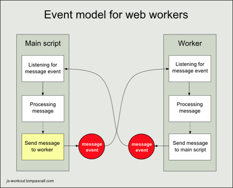
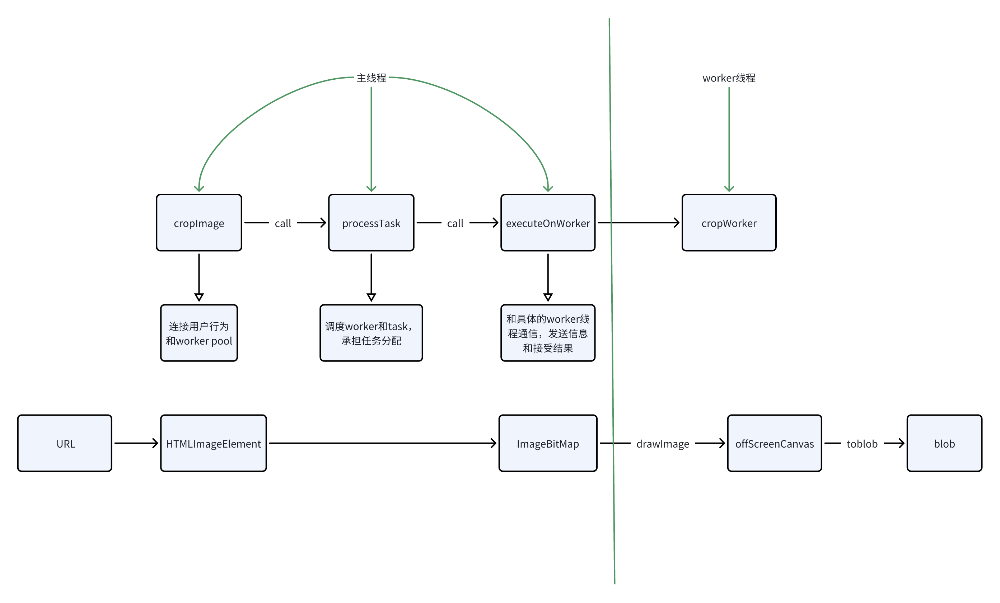

## web worker基本介绍

### **Web Workers 基本概念**

在前端开发中，**JavaScript** **是单线程的**：

- 主线程负责页面渲染、用户交互和脚本执行。
- 一旦主线程执行耗时操作（如复杂计算、数据处理），就可能导致页面卡顿，用户体验变差。

**Web Workers** 就是为了解决这个问题的机制。

1. 什么是 Web Worker？
	
	Web Worker 是浏览器提供的一种在 **后台线程** 中运行 JavaScript 的方法。 它允许你把耗时的任务丢到独立线程里执行，不会阻塞主线程，从而保持页面流畅。

2. 特点

- **独立线程**：Worker 运行在单独的线程中，不影响主线程渲染。
- **无** **DOM** **访问**：Worker 无法直接操作 DOM，只能通过 **消息机制** 和主线程通信。
- **数据传递**：主线程与 Worker 通过 `postMessage` 和 `onmessage` 进行数据传递，数据是 **拷贝** 或 **共享（SharedArrayBuffer）** 的形式。
- **同源限制**：加载的 worker 脚本必须与主页面同源，且受 CORS 限制。

### 主线程和worker线程的通信

通过这两个方法来实现数据通信：

- `postMessage`：**发送消息**
- `onmessage`：**接收消息**

两者是配套的：

- **主线程 → worker**：主线程用 `worker.postMessage(...)`，worker 用 `onmessage` 接收。
- **worker → 主线程**：worker 用 `postMessage(...)`，主线程用 `worker.onmessage` 接收。




message的引用是不同的，事实上是对数据进行复制

当你调用 `postMessage(data)` 时，数据会经过 **结构化克隆算法**：

- 绝大多数对象会被“深拷贝”。
- 主线程和 Worker 拿到的是**两个独立的副本**，修改一方不会影响另一方。

结构化克隆算法用于复制复杂的 JavaScript 对象。它在使用 `structuredClone()` 内部调用时，通过 `postMessage()` 在 Workers 之间传输数据，使用 IndexedDB 存储对象，或为其他 API 复制对象时被使用。

如裁剪图片中用到的
- `[ImageBitmap](https://developer.mozilla.org/en-US/docs/Web/API/ImageBitmap)`
- `[ImageData](https://developer.mozilla.org/en-US/docs/Web/API/ImageData)`
- ......

[Transferable objects](https://developer.mozilla.org/en-US/docs/Web/API/Web_Workers_API/Transferable_objects) are transferred from one context to another with a zero-copy operation, which results in vast performance improvement when sending large data sets.

有些大对象（如二进制数据缓冲区）**拷贝开销非常大**，这时可以把它们作为 **Transferable Objects** 传递。

这种方式不是复制，而是 **把对象的所有权直接交给接收方**：

- 发送方立刻失效（变成 “neutered”，比如 `ArrayBuffer.byteLength` 会变成 0）。
- 接收方直接拿到原始内存，效率极高。

支持的主要类型：
- `ArrayBuffer`
- `MessagePort`
- `ImageBitmap`
- （更现代的）`OffscreenCanvas`
- 等等

## 性能优化

批量裁剪图片的场景显然可以用worker并行处理

这里我们需要设计一个worker pool进行任务调度，思想和线程池是类似的

### worker pool设计

三个队列：

```
class WorkerPool {
  private workers: Worker[]           // ① 总 Worker 池
  private availableWorkers: Worker[]  // ② 空闲 Worker 队列
  private queue: Array<{...}>         // ③ 待处理任务队列
}
```

状态转换：
```
任务请求
  ↓
availableWorkers 有空闲?
  ↓ 是                    ↓ 否
立即执行                加入 queue
  ↓                       ↓
Worker 从 available   等待空闲 Worker
移到"工作中"状态            ↓
  ↓                   Worker 完成任务
任务完成                   ↓
  ↓                   从 queue 取出
Worker 回到 available     ↓
  ↓                     立即执行
检查 queue 是否有任务
  ↓ 有
递归处理下一个
```

场景 1: 有空闲 Worker:

```js
cropImage(params) {
  if (availableWorkers.length > 0) {
    // ② 从空闲队列取出
    const worker = availableWorkers.pop()
    
    // 执行任务 (Worker 进入"工作中"状态)
    executeOnWorker(worker, params)
    
    // 完成后
    finally {
      // ② 放回空闲队列
      availableWorkers.push(worker)
      
      // ③ 检查待处理队列
      if (queue.length > 0) {
        const next = queue.shift()  // 取出下一个任务
        processTask(next)           // 递归处理
      }
    }
  }
}
```

场景 2: 无空闲 Worker:

```js
cropImage(params) {
  if (availableWorkers.length === 0) {
    // ③ 加入待处理队列
    queue.push({ params, resolve, reject })
    
    // 等待某个 Worker 完成任务后被唤醒
  }
}
```

executeOnWorker与worker通信

```js
private async executeOnWorker(worker: Worker, params: CropParams): Promise<Blob> {
    const { img, crop, scale = 1, rotate = 0 } = params;

    // 使用 createImageBitmap 创建可转移的 ImageBitmap
    // 这比 canvas 操作更快，且支持零拷贝转移到 Worker
    const imageBitmap = await createImageBitmap(img);

    // 准备消息
    const message: CropMessage = {
      type: "crop",
      imageBitmap,
      crop,
      scale,
      rotate,
      pixelRatio: window.devicePixelRatio,
      imageNaturalWidth: img.naturalWidth,
      imageNaturalHeight: img.naturalHeight,
      imageDisplayWidth: img.width,
      imageDisplayHeight: img.height,
    };

    // 发送到 Worker 并等待响应
    // 使用 Transferable Objects 零拷贝转移 ImageBitmap 所有权
    return new Promise((resolve, reject) => {
      const handleMessage = (e: MessageEvent<CropResponse>) => {
        const response = e.data;

        if (response.type === "success" && response.blob) {
          worker.removeEventListener("message", handleMessage);
          resolve(response.blob);
        }
        else if (response.type === "error") {
          worker.removeEventListener("message", handleMessage);
          reject(new Error(response.error || "Unknown worker error"));
        }
      };

      worker.addEventListener("message", handleMessage);
      // 第二个参数指定 transferable 对象，实现零拷贝转移
      worker.postMessage(message, [imageBitmap]);
    });
  }

  terminate() {
    this.workers.forEach(worker => worker.terminate());
    this.workers = [];
    this.availableWorkers = [];
    this.queue = [];
  }
}
```

- 和worker线程通信
    
- 直接控制执行任务，收集裁剪参数和图像参数，作为message发送给worker线程
    
- handleMessage：收到message后，处理结果
    
- 监听worker线程的message
    
- 向worker线程发送message

### 不同代码对应的layer



```
主线程
  HTMLImageElement
      ↓ createImageBitmap
  ImageBitmap  (Transfer)
      ↓
Worker
  ImageBitmap → drawImage → OffscreenCanvas
                               ↓
                            toBlob()

```

这里涉及了transferable object的决策

**第一点：核心目标只有一个——避免主线程拷贝和阻塞**

图像数据体量大、裁剪调用频繁，如果输入不是 Transferrable，就一定会发生结构化拷贝，主线程会被拖慢。选择 ImageBitmap / OffscreenCanvas 的本质不是“新 API”，而是**把图像内存的所有权直接转交给 Worker**，实现零拷贝。

**第二点：输入类型决定“责任划分”而不是性能高低**

ImageBitmap 代表的是“已经解码好的静态图像”，主线程负责解码，Worker 只做纯计算；OffscreenCanvas 代表的是“可绘制的工作区”，主线程只交付资源，Worker 持有绘制与状态。两者性能差异不是关键，**关键是谁持有状态、谁负责生命周期**。

**第三点：裁剪场景更适合“无状态输入”**

你的裁剪任务是一次性的、可并行的、无连续状态需求的计算，因此用 ImageBitmap 这种“输入即快照、处理即结束”的 Transferrable 最符合模型；OffscreenCanvas 会引入状态管理和生命周期复杂度，在这个场景下属于过度设计。


> **Transferrable Object 的输入设计，本质是在选择：  
> 是把“图像结果”交给 Worker，还是把“工作台”交给 Worker。  
> 你的场景需要前者。**

### Promise包装事件通信

```js
    return new Promise((resolve, reject) => {
      let timeoutId: number | null = null;
      let isResolved = false;
      let messageHandler: ((e: MessageEvent<CropResponse>) => void) | null = null;
      let errorHandler: ((error: ErrorEvent) => void) | null = null;

      const cleanup = () => {
        if (timeoutId !== null) {
          clearTimeout(timeoutId);
          timeoutId = null;
        }
        if (messageHandler) {
          worker.removeEventListener("message", messageHandler);
          messageHandler = null;
        }
        if (errorHandler) {
          worker.removeEventListener("error", errorHandler);
          errorHandler = null;
        }
      };

      messageHandler = (e: MessageEvent<CropResponse>) => {
        if (isResolved)
          return;

        const response = e.data;

        if (response.type === "success" && response.blob) {
          isResolved = true;
          cleanup();
          resolve(response.blob);
        }
        else if (response.type === "error") {
          isResolved = true;
          cleanup();
          reject(new Error(response.error || "Unknown worker error"));
        }
      };
      
      // ...一些超时保护逻辑

      worker.addEventListener("message", messageHandler);
      worker.addEventListener("error", errorHandler);

      // 第二个参数指定 transferable 对象，实现零拷贝转移
      try {
        worker.postMessage(message, [imageBitmap]);
      }
      catch (error) {
        isResolved = true;
        cleanup();
        reject(new Error(`Failed to post message: ${error instanceof Error ? error.message : "Unknown error"}`));
      }
    });
```


通过Promise包装把一个持久的事件通信连接，转换为了一个从调用到结果的过程（通过在拿到结果或者异常时将promise settled）

这也意味着他能够使用promise的各种调度方式，允许加入数组中使用promise.all 并发，能够使用async，await，以及进行并发限制等等调度

### 并发控制逻辑

```js
async function runWithConcurrencyLimit<T, R>(
  tasks: T[],
  maxConcurrency: number,
  processor: (task: T, index: number) => Promise<R>,
): Promise<R[]> {
  const results: (R | null)[] = Array.from({ length: tasks.length });
  const executing: Promise<void>[] = [];

  for (let i = 0; i < tasks.length; i++) {
    const task = tasks[i];
    const taskIndex = i;

    const promise = (async () => {
      try {
        const result = await processor(task, taskIndex);
        results[taskIndex] = result;
      }
      catch (error) {
        console.error(`任务 ${taskIndex + 1} 执行失败:`, error);
        results[taskIndex] = null;
      }
    })();

    executing.push(promise);

    if (executing.length >= maxConcurrency) {
      await Promise.race(executing.map(p => p.then(() => p)));
      executing.shift(); // 移除第一个
    }
  }

  await Promise.all(executing);
  return results as R[];
}
```

- 迅速执行同步循环，启动异步任务，然后存储在执行中队列里
- 这里直接执行的匿名异步函数，启动了异步任务，并返回一个空的promise对象
- 因为这里的目的是追踪任务的完成状态，而不是获取结果：
- Promise 会在所有 await 完成后 resolve：当 await processor(task, taskIndex) 完成后，函数继续执行，然后自然结束，Promise 就 resolved 了

```js
executing.push(promise);  // 只关心这个 Promise 什么时候 resolve

if (executing.length >= maxConcurrency) {
  await Promise.race(executing);  // 等待任意一个完成
}

await Promise.all(executing);  // 等待所有完成
```

- 一旦执行中队列的大小超过限制，就去掉一个元素
- 直到收集完所有结果，进行返回

## 主线程的实际调用方式


将任务分为三个阶段

```Plain
阶段1: 图片1加载 ∥ 图片2加载 ∥ 图片3加载 ∥ ... (并行)
  ↓
阶段2: 图片1裁剪 ∥ 图片2裁剪 ∥ 图片3裁剪 ∥ ... (Worker Pool并行)
  ↓
阶段3: 图片1上传 ∥ 图片2上传 ∥ 图片3上传 ∥ ... (并行)
```

  **核心思想：****`Promise.all`** **负责“管理”和“同步”并发任务，而 Web Worker 负责“执行”真正的****并行计算****。**

1. **并发模型概览**
```JavaScript
主线程发起多个任务 → Promise.all 并行等待 → Worker 池调度执行 → 返回结果
         ↓                 ↓                      ↓
创建 N 个 Promise    同时等待所有 Promise   最多 M 个 Worker 并行处理
```

2. 去掉并发控制的源码

```TypeScript
    try {
      setIsProcessing(true);

      console.warn(`开始批量裁剪 ${filteredAvatars.length} 张${isAvatarMode ? "头像" : "立绘"}`);

      // 阶段1：加载图片（用装饰器包装，不改变原逻辑）
      const loadedImages = await monitor.measure("加载", async () => {
        const imageLoadPromises = filteredAvatars.map(async (avatar, index) => {
          const imageUrl = avatar.spriteUrl;
          if (!imageUrl || !avatar.avatarId)
            return null;

          console.warn(`加载 ${index + 1}/${filteredAvatars.length}`);

          const tempImg = new Image();
          tempImg.crossOrigin = "anonymous";

          await new Promise<void>((resolve, reject) => {
            tempImg.onload = () => resolve();
            tempImg.onerror = () => reject(new Error(`Failed to load: ${imageUrl}`));
            tempImg.src = imageUrl!;
          });

          return { avatar, img: tempImg, index };
        });

        return (await Promise.all(imageLoadPromises)).filter(Boolean);
      });

      // 阶段2：裁剪图片
      const croppedResults = await monitor.measure("裁剪", async () => {
        const cropPromises = loadedImages.map(async (item: any) => {
          if (!item)
            return null;

          try {
            const croppedBlob = await getCroppedImageBlobFromImg(item.img);
            return { ...item, croppedBlob };
          }
          catch (error) {
            console.error(`裁剪失败 (${item.index + 1}):`, error);
            return null;
          }
        });

        return (await Promise.all(cropPromises)).filter(Boolean);
      });

      // 阶段3：上传结果
      await monitor.measure("上传", async () => {
        const uploadPromises = croppedResults.map(async (item: any, idx: number) => {
          if (!item || !item.avatar.roleId)
            return null;

          try {
            if (isAvatarMode) {
              await applyCropAvatarMutation.mutateAsync({
                roleId: item.avatar.roleId,
                avatarId: item.avatar.avatarId!,
                croppedImageBlob: item.croppedBlob,
                currentAvatar: item.avatar,
              });
            }
            else {
              await applyCropMutation.mutateAsync({
                roleId: item.avatar.roleId,
                avatarId: item.avatar.avatarId!,
                croppedImageBlob: item.croppedBlob,
                transform,
                currentAvatar: item.avatar,
              });
            }
            console.warn(`上传完成 (${idx + 1}/${croppedResults.length})`);
            return true;
          }
          catch (error) {
            console.error(`上传失败 (${idx + 1}):`, error);
            return false;
          }
        });

        await Promise.all(uploadPromises);
      });

      monitor.printReport(filteredAvatars.length);
    }
```

## 文件上传的过程

文件上传的目标是，将裁剪返回的blob，转换为一个URL，给到后端oss

1. 直接使用blob构造new File创建file对象
2. 走压缩文件的逻辑，画一个canvas，然后toblob转webp再压质量，reader读回file
3. 利用哈希算法构造文件名
4. 走OSS两步上传（先get一个临时的url），再上传

安全性：

- 避免在前端暴露OSS的访问密钥（AccessKey/SecretKey）
- 后端可以控制上传权限、文件大小、文件类型等

性能：

- 文件直接从浏览器传到OSS，不经过应用服务器
- 减轻应用服务器带宽压力
- 上传速度更快（直连OSS节点）

可控性：

- 后端可以统一管理文件命名规则
- 可以记录上传日志
- 可以设置URL过期时间

这是云存储服务（如阿里云OSS、AWS S3、腾讯云COS等）推荐的最佳实践。

## 裁剪框本身的工作流

1. 图片加载 → onImageLoad 初始化裁剪区域
2. 用户拖拽 → onCropChange 实时更新裁剪框
3. 拖拽结束 → handleCropComplete 确定最终裁剪区域
4. 自动预览 → useCropCanvas hook 防抖更新 Canvas 预览
5. 应用裁剪 → 使用 previewCanvasRef 导出裁剪结果

仅仅负责UI的实时交互和预览，为worker pool提供裁剪框参数

```
用户拖拽裁剪框
    ↓
ReactCrop 组件触发 onComplete
    ↓
useCropPreview.onCropComplete(pixelCrop)
    ↓
setCompletedCrop(pixelCrop)  ← 存储裁剪参数
    ↓
【用户点击"一键裁剪"】
    ↓
handleBatchCropAll()
    ↓
getCroppedImageBlobFromImg(img)
    ↓
cropImage({
  img: tempImg,
  crop: completedCrop,  ← 从 useCropPreview 获取
  scale: 1,
  rotate: 0
})
    ↓
WorkerPool.cropImage(params)
    ↓
executeOnWorker(worker, params)
    ↓
worker.postMessage({
  imageBitmap,
  crop: completedCrop,  ← 传递给 Worker
  ...
})
    ↓
[Worker 线程] canvasPreviewOffscreen(imageBitmap, crop, ...)
    ↓
使用 crop.x, crop.y, crop.width, crop.height 裁剪
    ↓
返回 Blob

```

### 抽象出的canvasPreview hooks的工作流


这个 `useCropPreview` 本质上做了三件事：

- **React State**：只描述「裁剪参数与结果引用」
- **Refs**：持有真实的 DOM（img / canvas）
- **命令式流程**：在正确的时机，把参数“灌”进 canvas 计算


```
[用户选择图片]
      ↓
[ 加载完成] → 触发 onImageLoad
      ↓
1. 计算初始裁剪框 (Avatar/Sprite)
2. 设置 crop 状态 (UI显示框)
3. 绘制第一帧 Canvas 预览
      ↓
[用户拖拽裁剪框]
      ↓
onCropChange (更新 UI 位置)
      ↓
[用户松开鼠标]
      ↓
onCropComplete (更新 pixelCrop)
      ↓
[useCropCanvas] (防抖 100ms)
      ↓
调用 canvasPreview (绘制 Canvas)
      ↓
更新 previewDataUrl (预览图更新)
      ↓
[用户点击保存]
      ↓
getCroppedFile
      ↓
canvasPreview({ previewMode: false }) (高清重绘)
      ↓
返回 File 对象
```

canvas操作本身是命令式的，为了持久的持有同一个canvas，而不受react的render影响

为什么一定要有ImageRef

1. Canvas API 的硬性要求（核心原因）

裁剪的本质是将图片的一部分绘制到 Canvas 上。在 HTML5 Canvas API 中，drawImage 方法**不接受图片 URL 字符串**，它必须接受一个**真实存在的 DOM 元素**（如 HTMLImageElement、HTMLCanvasElement 或 HTMLVideoElement）。

2. 计算缩放比例（Scale）

这是裁剪中最容易出 Bug 的地方。

- **显示尺寸**：CSS 限制图片在屏幕上显示的大小（例如：手机上宽 300px）。
- **原始尺寸**：图片文件的实际分辨率（例如：原图宽 4000px）。

用户是在“显示尺寸”上拖拽裁剪框的，但我们最终生成图片时，需要基于“原始尺寸”进行裁剪，才能保证高清。

我们需要访问 `` DOM 节点的两个属性来计算缩放比：

1. element.width / element.height (CSS 渲染宽高)
2. element.naturalWidth / element.naturalHeight (图片原始宽高)

React 的 State 通常只存图片的 URL，不会实时去存这些 DOM 属性（因为它们是浏览器渲染后才有的）。通过 ref，我们可以随时读取这些属性。

图片加载阶段 (Image Loading)：

1. **获取尺寸**：读取图片的**显示尺寸**（width, height）。注意这里特意注释了不使用 naturalWidth，是为了保证裁剪框能正确匹配 CSS 缩放后的图片。
    
2. **计算初始裁剪框**：
    
    - 调用 getMode() 判断是头像模式（avatar）还是原图模式（sprite）。
        
    - 如果是 avatar，调用 createCenteredSquareCrop 生成一个居中的正方形裁剪框。
        
    - 如果是 sprite，调用 createFullImageCrop 覆盖全图。
        
3. **更新状态**：设置 crop 和 completedCrop，让裁剪框在 UI 上显示出来。
    
4. **生成首帧预览**：
    
    - 为了防止图片刚加载时 Canvas 是空白的，这里**立即**调用了一次 canvasPreview。
        
    - 利用 canvas.toBlob 生成预览 URL，并更新 previewDataUrl。
        
5. **扩展回调**：最后调用 onImageLoadExtend，允许外部插入额外的业务逻辑（比如记录日志、重置其他状态）。

### 核心设计决策

#### 1. 动态模式支持

支持静态值和动态函数两种方式指定裁剪模式，适应不同场景：  

```TypeScript
type UseCropPreviewOptions = {
  // 支持 'avatar' | 'sprite' 或 () => CropMode
  mode: CropMode | (() => CropMode);
  // ...
};

// 使用时可以响应状态变化
const { ... } = useCropPreview({
  mode: () => currentStep === 1 ? 'sprite' : 'avatar',
});
```

#### 2. 外部 Ref 注入

解决了 Canvas 必须挂载到 DOM 才能工作的问题：

```TypeScript
type UseCropPreviewOptions = {
  imgRef?: RefObject<HTMLImageElement | null>;
  previewCanvasRef?: RefObject<HTMLCanvasElement | null>;
};

// Hook 内部处理
const internalImgRef = useRef<HTMLImageElement>(null);
const imgRef = externalImgRef ?? internalImgRef;
```

  这个设计源于实际踩坑：最初我让 Hook 内部创建 Ref，但组件需要在特定位置渲染 Canvas，导致 Ref 无法正确绑定。

#### 3. 预览模式与全分辨率导出分离

这是性能优化的关键：
```TypeScript
// canvasPreview 支持预览模式
export async function canvasPreview(
  image, canvas, crop, scale, rotate,
  options?: { 
    previewMode?: boolean;      // 预览模式限制分辨率
    maxPreviewSize?: number;    // 最大预览尺寸，默认 800
  }
) {
  // 预览模式下降低分辨率和 pixelRatio
  const pixelRatio = previewMode 
    ? Math.min(window.devicePixelRatio, 1.5) 
    : window.devicePixelRatio;
  
  // 预览模式限制最大尺寸
  if (previewMode && maxDimension > maxPreviewSize) {
    downscaleRatio = maxPreviewSize / maxDimension;
  }
}

// 导出时以全分辨率重绘
const getCroppedFile = async (fileName) => {
  await canvasPreview(img, canvas, crop, 1, 0, { previewMode: false });
  return getCroppedImageFile(canvas, fileName);
};
```

#### 4. 统一导出接口

从原来 6+ 个导出函数简化为 2 个核心函数：

```TypeScript
// 重构前：多种输入输出组合
getCroppedFileFromCanvas(canvasRef, fileName)           // Ref → File
getCroppedUrlFromRefs(imgRef, canvasRef, crop)          // Refs + Crop → URL
getRescaledCrop(image, canvas, crop, 'file', fileName)  // Elements → File
getRescaledCrop(image, canvas, crop, 'dataUrl')         // Elements → URL
// ...更多变体

// 重构后：统一从 Canvas 导出
canvasToBlob(canvas)           // 基础：Canvas → Blob
getCroppedImageFile(canvas, fileName)  // 便捷：Canvas → File
```