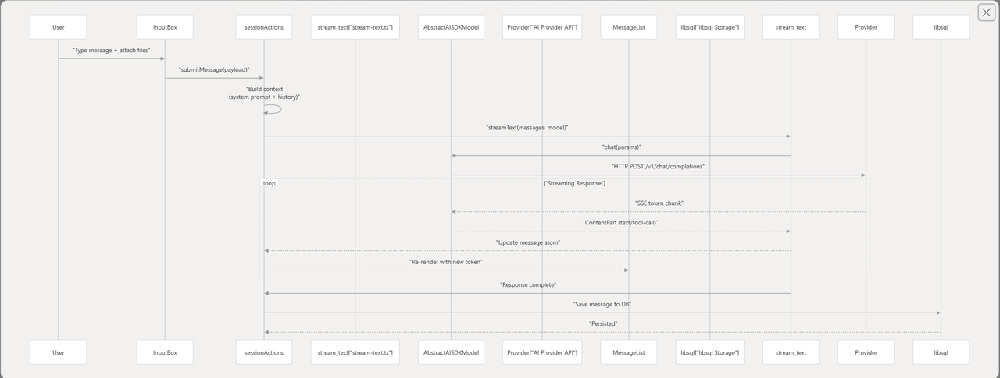

## Action.ts

我之前在解耦Cropper组件的时候，思维是这两个组件有好多重复逻辑，但是局部又各不相同，有什么办法把他们提取出来，然后就想到创建一个自定义hooks，导出各种可以共用的函数，创建共用的状态

之所以看到Action会觉得很疑惑就是，这一套想法好像和之前解耦Cropper的时候完全是通用的，但他们明显是不同的东西，那么他们的区别本质到底是什么呢，以及Action层和状态管理库的关系又是什么

什么是UI逻辑？什么是业务逻辑？

最初我尝试从代码的写法结构出发，去尝试区分两者，但这是完全错误的思路！！！

他们都是通过操作state，对逻辑通过函数进行封装，暴露出去，类似一个接口一样的ts文件

> Action也可能使用uiStore的内容，可能会影响UI的效果
>
> 而hooks也不一定会用到react原生的hooks，可能也是对于全局状态的操作
>
> 这里是没有什么规律的

* **从实现能力上看：本质都是 JS/TS 代码，都是逻辑。**

* **从设计上看：我们刻意“逻辑分层”——**
  **相同的底层能力，被组织进不同职责的文件里。**

Action 的语义定义

* 面向的是：**系统的行为 / 用例**。

* 你可以把它说出口，像这样：

  * “发送一条消息”

  * “再生成一次回复”

  * “激活 license”

  * “滚动到某条消息”

  * “切换当前会话”

* 它回答的是：

> - 当用户/系统想完成 X 这件事时，**系统内部要按什么顺序去操作各种状态和服务**？

Hook 的语义定义:

* 面向的是：**组件的行为和使用体验**。

* 你可以把它说出口，像这样：

  * “这个输入框要有草稿、历史记录、上下键切换、发送时清空”

  * “这个选择器要关联当前会话的 knowledge base”

  * “这个按钮点一下要显示 2 秒的已复制状态”

* 它回答的是：

> 某个组件，为了在屏幕上表现得“好用”，**需要管理哪些本地 state、订阅哪些全局状态、暴露哪些 handler**？

他们的位置也反应了他们各自的语义，hooks往往是根目录下一级和components同级的，而Action是和Store一起定义的，因为Action本身是脱离UI的，是纯粹的数据处理，借助API和state就应该可以完成的，而hooks是依赖Component的

本质是对业务逻辑和UI逻辑的区分

## chatbox怎么决策的

chatbox的架构：
在上述架构的基础上，对Store做出区分，分为全局状态和原子状态
原子状态使用jotai，全局状态使用的zustand

### Action Layer

虽然之前说了很多，但是这个Layer其实不是什么范式，并不是大多数应用都会采用的
他们采用这个层的原因是，AI chat应用极其复杂的业务逻辑

比如AI生成一条消息要走那么多Layer，中途会受到非常多外部干扰

### zustand & jotai

状态管理库的混用和历史是有关的：
原本他们是只采用jotai的，但是遇到了一些jotai无法处理的需求

然后进行了一次重构：

1. 当时重构（`Refactor/settings store`）的核心需求

* `settingsStore` 需要：

  * 复杂持久化：自定义 `storage`（异步）、只存部分字段（`partialize`）。

  * 版本控制与迁移：`version` + `migrate`，配合 `deepmerge(defaults.settings(), persisted)` 和 `SettingsSchema` 校验。

  * 明确的 hydration 生命周期：`skipHydration` + `initSettingsStore` + `onFinishHydration`。

* 需要在 **React 之外** 集中处理「配置变更 → 平台副作用」：

  * `platform.ensureShortcutConfig`

  * `platform.ensureProxyConfig`

  * `platform.ensureAutoLaunch`

* 希望有一个「全局配置服务」：

  * 组件内用 `useSettingsStore(selector)`。

  * 任意 TS 模块可用 `settingsStore.getState()/setState()/subscribe`。

* 同一 commit 下，还要统一处理：

  * UI 运行时状态（`uiStore`：toast、Ref、UI 偏好）。

  * 最近使用模型（`lastUsedModelStore`：持久化 + `skipHydration` + `initLastUsedModelStore`）。

- Jotai 在这些场景下的局限（相对 Zustand）

* 虽然有 `atomWithStorage` / `createJSONStorage`，但：

  * 没有内建 `version/migrate`，复杂迁移逻辑需要自己拼一层「管理器」，操作多 atom，工程量大。

  * 很难像现在这样，对“整棵 settings 树”做一次性 `deepmerge + Zod 校验 + migrate`。

* 在 React 之外集中订阅 + 触发副作用不够直观：

  * 主流用法是 React 组件内 `useAtom` + `useEffect`，不适合做 Electron 层的统一副作用中心。

  * 要实现「store + subscribe + selector」式用法，需要自己造轮子。

* 「状态 + 行为」模式（state + methods）对 Jotai 不自然：

  * 需要自己封装大量 hooks / action 层；而 Zustand 直接用 `createStore((set, get) => ({ state, actions }))` 即可。

- 为什么当时选 Zustand 的 `createStore/persist/subscribeWithSelector`

* `createStore`（vanilla）：

  * 完全独立于 React，可在任何模块 `getState/setState/subscribe`。

  * 再配合 `useStore` 暴露给 React 使用，一处定义，双端可用。

* `persist`：

  * 内建：

    * `version` + `migrate(persisted, version)`：专门为版本迁移设计。

    * `partialize(state)`：精确控制持久化字段。

    * `storage`：可接入自定义异步 `storage`（Electron）。

    * `skipHydration` + `onFinishHydration`：明确 hydrate 生命周期。

  * 非常契合「复杂配置持久化 + 版本迁移 + 校验」的需求。

* `subscribeWithSelector` / `store.subscribe`：

  * 可以在 React 外、按字段精确订阅：`settings → platform` 副作用就集中在一处管理。

  * 不依赖组件挂载，启动流程更可控。

- 当前整体图景

* 这次重构的结果：引入了一套「以 Zustand 为核心的全局配置/UI 服务层」：

  * `settingsStore`：配置单一数据源 + 持久化/迁移 + 副作用中心。

  * `uiStore`：UI 运行时状态（Ref/toast/部分 UI 偏好）。

  * `lastUsedModelStore`：最近使用模型的轻量持久化。

* 后续又引入/强化了 Jotai，用于：

  * 业务态、会话态、部分 UI/配置状态的原子化管理（index.ts 导出的这些）。

* 现在的分工：

  * **Zustand**：底层配置、UI 服务、RefObject、复杂持久化/迁移、副作用中心。

  * **Jotai**：业务/配置的细粒度原子状态，和 React 组件深度结合。

***

